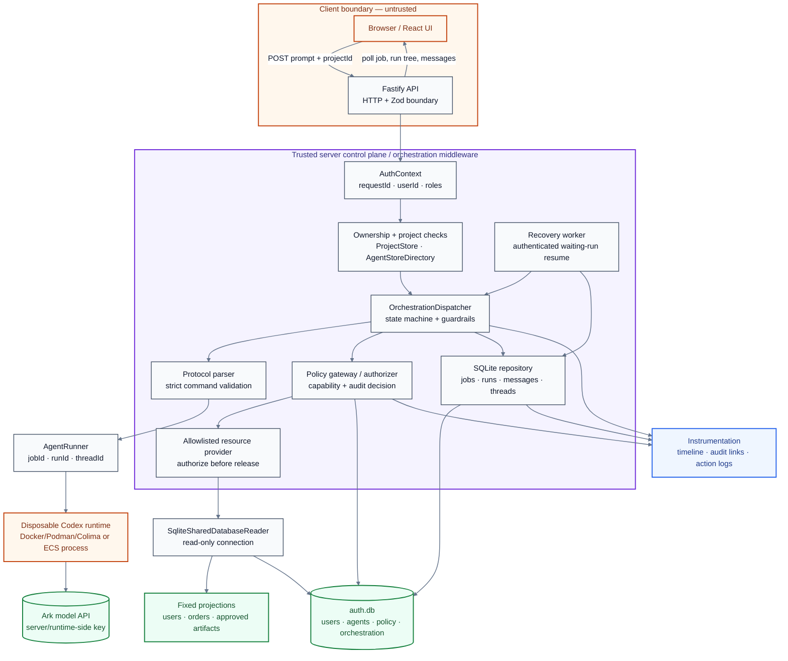

# Orchestration Middleware Architecture

This page is the one-page architecture deliverable for the implemented
orchestration middleware. It shows the request path, trust boundaries,
authorization enforcement, instrumentation, and restart recovery points.

## Data flow (Alice → Bob → database:users)

1. The browser sends only the prompt and optional project ID. It cannot choose
   the acting user, hidden project orchestrator, or authorization decision.
2. Fastify authenticates the session, creates a server-owned `AuthContext`,
   validates the body, and checks project/Agent ownership.
3. A SQLite transaction creates the job, root run, and initial prompt event.
   The API returns `202 Accepted`; the UI polls the job and message endpoints.
4. The dispatcher starts the root run, parses the Agent's JSON command, and
   rejects prose or unknown fields before dispatching child work.
5. For a delegation/resource request, the parent is durably set to `waiting`.
   The policy gateway authorizes Bob's `invoke` capability and the
   `read / data_asset / database:users` capability before any provider lookup.
6. The provider accepts only an allowlisted query such as
   `users.list?status=active&limit=25&sort=username_asc`; the read-only adapter
   returns the fixed user projection and never executes Agent-supplied SQL.
7. The `tool_result` is persisted, Alice resumes on her own run-level
   `codex_thread_id`, and the root run eventually emits a validated `final`.
8. The UI renders the root/child run tree, denials, results, and audit-linked
   timeline. On restart, only a worker with a terminal child and reconstructable
   authenticated context may resume a waiting run; otherwise reconciliation
   cancels it safely.

## Enforcement points

| Stage | Component | Enforced rule | Evidence |
| --- | --- | --- | --- |
| Request | Fastify API | Authenticated session, Zod body/params, object ownership | `apps/server/src/app.ts` |
| Identity | `AuthStore` / `AuthContext` | User identity comes from the server, not JSON input | `apps/server/src/auth-store.ts` |
| Project | `ProjectStore` | Membership, project Agent membership, and hidden orchestrator checks | `apps/server/src/projects.ts` |
| Command | Protocol parser | Only `final`, `delegate`, `delegate_parallel`, and `resource_request` are valid | `apps/server/src/orchestration-protocol.ts` |
| Delegation | Dispatcher | Stable `agent_key`, ready state, cycle/depth/run limits, parent/job lineage | `apps/server/src/orchestration-dispatcher.ts` |
| Policy | Gateway/authorizer | Human permission ∩ Agent principal ∩ scoped capability; deny by default | `apps/server/src/agent-policy-gateway.ts` |
| Resource | Allowlisted provider | `read` + `data_asset` only; fixed artifacts and query DSL; sanitize before release | `apps/server/src/orchestration-resource-provider.ts` |
| Persistence | SQLite repository | Atomic transitions, ordered events, unique active-run invariant, run-owned threads | `apps/server/src/orchestration-sqlite-repository.ts` |
| Runtime | `AgentRunner` | Bounded output/time, cancellation, disposable execution boundary; Ark key stays server-side | `apps/server/src/*runner.ts` |

## Trust boundaries

- **Browser → API:** untrusted input. The client receives status and sanitized
  output only; it never receives credentials, workspace paths, or Ark keys.
- **API/dispatcher → policy/provider:** trusted control-plane boundary. Every
  Agent invocation and protected-resource read is checked before execution or
  data release.
- **Dispatcher → runtime:** disposable execution boundary. Local POC containers
  and the ECS process are operational isolation, not hardened multi-tenant
  isolation.
- **Provider → SQLite:** protected data boundary. `SqliteSharedDatabaseReader`
  opens the database read-only and exposes only approved columns and bounded
  queries (`users.list`, `users.summary`, `orders.list`, `orders.summary`).

## Instrumentation and recovery

| Concern | Implemented behavior |
| --- | --- |
| Timeline | `agent_messages` records prompt, delegation, progress, result, error, `tool_call`, and `tool_result` events in sequence order. |
| Correlation | Logs and runner requests carry `requestId`, `userId`, `jobId`, `runId`, Agent ID, status, and run-level thread ID. |
| Audit | `audit_logs`, `agent_action_logs`, and idempotent `audit_agent_context` links preserve authorization evidence. |
| Cancellation | Public cancel route marks queued/running/waiting work terminal and propagates cancellation to the active runner. |
| Restart | Startup reconciliation safely cancels unreconstructable active work; `OrchestrationRecoveryWorker` can resume waiting parents when child output and authenticated context are available. |
| Continuity | `waiting` persists the parent's thread and usage before child creation; child runs always use separate threads. |

## Implementation status and known limits

Implemented in the current repository: SQLite-backed Agent/orchestration
persistence, project orchestrators, run-level waiting/resume, sequential and
bounded parallel delegation, protected `database` and `database:users`
resources, capability selection, public orchestration APIs, polling/cancel
UI, structured logging, redacted diagnostics, and restart guardrails.

The remaining production-oriented limits are explicit: the local provider is a
sanitized POC catalog rather than an arbitrary production database gateway;
startup uses conservative reconciliation and the reusable recovery worker
needs an authenticated-context resolver; and the runtime boundary is not a
hardened multi-tenant sandbox. `JsonStore` is retained only as a first-start
legacy import source; SQLite is the active source of truth.

See the detailed contracts and checklists in
[`ORCHESTRATION_WORKFLOW.md`](docs/ORCHESTRATION_WORKFLOW.md),
[`MULTI_AGENT_AUTH_INTEGRATION.md`](docs/MULTI_AGENT_AUTH_INTEGRATION.md),
[`ORCHESTRATION_MIDDLEWARE_IMPLEMENTATION.md`](docs/ORCHESTRATION_MIDDLEWARE_IMPLEMENTATION.md),
and [`ARCHITECTURE.md`](docs/ARCHITECTURE.md).

**One-sentence architecture:** an authenticated Fastify request enters a
SQLite-backed dispatcher, which validates and authorizes every Agent command
before invoking isolated runtime work or an allowlisted sanitized resource,
while correlated events make the job observable and durable recovery keeps
waiting-run behavior safe across restarts.
