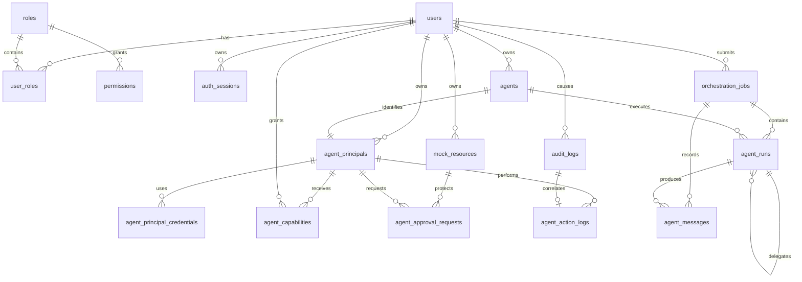

# Middleware Database Schema

Target schema for the hackathon middleware: authentication/authorization plus
multi-agent orchestration in one SQLite database.

**Status:** design reference for implementation

**Audience:** both middleware contributors, API contributors, and anyone
integrating the web UI with the server

**Important:** the current project uses a JSON store as a single-node proof of
concept. This document defines the SQLite target. It is intentionally small
enough to implement during the hackathon and explicit enough that both people
can work independently without creating incompatible tables.

## 1. Purpose and scope

The database must support:

1. identifying a user;
2. assigning one or more roles to that user;
3. checking whether a role may perform an action on an agent, run, or
   orchestration job;
4. recording authentication and authorization decisions;
5. registering agents and their runtime state;
6. tracking a top-level orchestration request;
7. tracking each agent execution within that request;
8. storing prompts, progress events, results, and errors in order; and
9. giving each Agent an independent, revocable runtime identity;
10. delegating narrow capabilities to Agent identities;
11. requiring human approval for selected writes; and
12. surviving a server restart without losing the execution history.

It does **not** attempt to be a production identity provider, workflow engine,
distributed queue, or multi-tenant platform.

## 2. Ownership split for two contributors

| Area | Primary owner | Tables | Responsibility |
| --- | --- | --- | --- |
| Authentication and authorization | Person A | `users`, `roles`, `user_roles`, `permissions`, `auth_sessions`, `audit_logs`, `agent_principals`, `agent_principal_credentials`, `agent_capabilities`, `mock_resources`, `agent_approval_requests`, `agent_action_logs` | Human login, Agent identity, delegated policy, approvals, revocation, and security audit records |
| Agent orchestration | Person B | `agents`, `orchestration_jobs`, `agent_runs`, `agent_messages` | Agent registry, job lifecycle, agent execution lifecycle, prompts/results/events |
| Shared integration | Both | `schema_migrations` and the contracts in this document | Migration order, IDs, status values, timestamps, JSON shapes, API response conventions |

Each person may use a separate local SQLite file while developing, but the
committed source of truth must be SQL migration files. Do not commit binary
`.db` files and try to merge them with Git.

## 3. Architecture

```text
Client
  |
  v
API request
  |
  +--> Authentication and policy middleware
  |      - hashes bearer token
  |      - loads user and roles
  |      - checks permission
  |      - authenticates Agent credentials
  |      - checks Agent capabilities and approvals
  |      - writes audit decisions
  |
  +--> Agent/orchestration service
         - checks agent ownership and status
         - creates orchestration job
         - creates agent runs
         - appends messages/events
         - updates final status
                |
                v
       data/middleware.db (SQLite)
```

The target database maps the current JSON concepts as follows:

| Current JSON concept | SQLite table |
| --- | --- |
| `Agent` | `agents` |
| `Message` | `agent_messages` |
| `AgentRun` | `agent_runs` |
| One future multi-agent request | `orchestration_jobs` |

### Relationship overview



## 4. Shared conventions

### IDs

- All IDs are application-generated UUID strings stored as `TEXT`.
- Generate IDs before inserting rows, using UUIDv4 or UUIDv7.
- Do not use SQLite auto-increment IDs for shared entities. App-generated IDs
  make independently developed tables and imported data easier to combine.
- `agents.id` is the internal identifier used by APIs and foreign keys.
- `agents.agent_key` is a stable human-readable key used by permissions, for
  example `planner` or `researcher`. It must not be silently changed after an
  agent is referenced by a permission.

### Types

SQLite has flexible type affinity, so the application must enforce these
conventions:

| Meaning | SQLite representation |
| --- | --- |
| Boolean | `INTEGER NOT NULL` with `CHECK (value IN (0, 1))` |
| Timestamp | `TEXT` in UTC ISO-8601 format, for example `2026-08-29T10:15:00.000Z` |
| JSON object/array | `TEXT` containing valid JSON; application validates it before writing |
| Token/password | Store only a password hash or token hash, never the raw value |

### Status values

The API and database must use the same lowercase values:

```text
Agent:   ready | busy | stopped | error
Job/run: queued | running | completed | failed | cancelled
Decision: allow | deny
```

### SQLite connection defaults

Every connection that uses this database should execute:

```sql
PRAGMA foreign_keys = ON;
PRAGMA busy_timeout = 5000;
```

WAL mode is appropriate for the single-node app but is a deployment choice:

```sql
PRAGMA journal_mode = WAL;
```

## 5. Table definitions

### 5.1 `schema_migrations`

Tracks applied migrations. It is owned by both contributors and should be the
first table created.

| Column | Type | Constraints | Meaning |
| --- | --- | --- | --- |
| `version` | `INTEGER` | Primary key | Monotonically increasing migration number |
| `name` | `TEXT` | Not null, unique | Migration filename or name |
| `applied_at` | `TEXT` | Not null, default UTC now | When the migration was applied |

### 5.2 `users`

Stores people who can authenticate and submit or inspect work.

| Column | Type | Constraints | Meaning |
| --- | --- | --- | --- |
| `id` | `TEXT` | Primary key | UUID for the user |
| `username` | `TEXT` | Not null, unique, case-insensitive | Login name |
| `email` | `TEXT` | Nullable, unique, case-insensitive | Optional contact/login email |
| `password_hash` | `TEXT` | Not null | Argon2id or bcrypt hash; never plaintext |
| `display_name` | `TEXT` | Nullable | Name shown in the UI |
| `is_active` | `INTEGER` | Not null, default `1`, must be `0` or `1` | Disabled users cannot authenticate |
| `created_at` | `TEXT` | Not null, default UTC now | Creation time |
| `updated_at` | `TEXT` | Not null, default UTC now | Last profile/status change |

### 5.3 `roles`

Defines named bundles of permissions.

| Column | Type | Constraints | Meaning |
| --- | --- | --- | --- |
| `id` | `TEXT` | Primary key | UUID for the role |
| `name` | `TEXT` | Not null, unique, case-insensitive | For example `admin`, `developer`, `viewer` |
| `description` | `TEXT` | Nullable | Human-readable explanation |
| `created_at` | `TEXT` | Not null, default UTC now | Creation time |

### 5.4 `user_roles`

Many-to-many relationship between users and roles.

| Column | Type | Constraints | Meaning |
| --- | --- | --- | --- |
| `user_id` | `TEXT` | Not null, foreign key to `users.id` | Assigned user |
| `role_id` | `TEXT` | Not null, foreign key to `roles.id` | Assigned role |
| `assigned_at` | `TEXT` | Not null, default UTC now | Assignment time |

The pair `user_id, role_id` is the primary key, so the same role cannot be
assigned twice to one user.

### 5.5 `permissions`

Answers: “Can this role perform this action on this resource?”

`resource_key = '*'` is a wildcard. For an agent permission,
`resource_key` contains `agents.agent_key`, not the mutable display name.

| Column | Type | Constraints | Meaning |
| --- | --- | --- | --- |
| `id` | `TEXT` | Primary key | UUID for the permission |
| `role_id` | `TEXT` | Not null, foreign key to `roles.id` | Role receiving the rule |
| `resource_type` | `TEXT` | Not null; `agent`, `run`, `orchestration`, or `system` | Protected resource family |
| `resource_key` | `TEXT` | Not null | Exact key or `*` |
| `action` | `TEXT` | Not null | For example `invoke`, `view`, `create`, `cancel`, or `*` |
| `allowed` | `INTEGER` | Not null, default `1`, must be `0` or `1` | Allow or explicit deny |
| `created_at` | `TEXT` | Not null, default UTC now | Creation time |

The tuple `role_id, resource_type, resource_key, action` is unique. The
application resolves rules from most-specific to least-specific in this order:

1. exact resource key and exact action;
2. wildcard resource key and exact action;
3. exact resource key and wildcard action;
4. wildcard resource key and wildcard action;
5. no matching row means deny.

The first matching row wins, including an explicit `allowed = 0`.

### 5.6 `auth_sessions`

Stores revocable login sessions. The client receives the raw token once; the
database stores only its hash.

| Column | Type | Constraints | Meaning |
| --- | --- | --- | --- |
| `id` | `TEXT` | Primary key | Session UUID |
| `user_id` | `TEXT` | Not null, foreign key to `users.id` | Session owner |
| `token_hash` | `TEXT` | Not null, unique | Hash of the bearer token |
| `expires_at` | `TEXT` | Not null | Expiration time |
| `revoked_at` | `TEXT` | Nullable | Set when the user logs out or the session is invalidated |
| `last_seen_at` | `TEXT` | Nullable | Last successful use |
| `created_at` | `TEXT` | Not null, default UTC now | Creation time |

A session is valid only when its user is active, `revoked_at IS NULL`, and
`expires_at` is in the future.

### 5.7 `audit_logs`

Records security-relevant decisions and important auth events. Keep these
records even when a user or agent is later deactivated.

| Column | Type | Constraints | Meaning |
| --- | --- | --- | --- |
| `id` | `TEXT` | Primary key | Audit event UUID |
| `request_id` | `TEXT` | Nullable | Correlation ID from the API request |
| `user_id` | `TEXT` | Nullable, foreign key to `users.id` with `ON DELETE SET NULL` | User involved, if known |
| `action` | `TEXT` | Not null | Event such as `login`, `invoke`, `view`, or `cancel` |
| `resource_type` | `TEXT` | Nullable | Resource family involved |
| `resource_key` | `TEXT` | Nullable | Resource key involved |
| `decision` | `TEXT` | Not null; `allow` or `deny` | Outcome |
| `reason_code` | `TEXT` | Not null | Stable code such as `permission_granted`, `session_expired`, or `user_inactive` |
| `metadata_json` | `TEXT` | Not null, default `{}` | Small, non-secret diagnostic context |
| `created_at` | `TEXT` | Not null, default UTC now | Event time |

Do not write passwords, raw bearer tokens, API keys, or full secret-bearing
prompts into `metadata_json`.

### 5.8 `agents`

Registry and current runtime state for each available agent.

| Column | Type | Constraints | Meaning |
| --- | --- | --- | --- |
| `id` | `TEXT` | Primary key | Agent UUID |
| `agent_key` | `TEXT` | Not null, unique, case-insensitive | Stable permission/reference key |
| `name` | `TEXT` | Not null | Display name |
| `description` | `TEXT` | Not null, default empty string | Short explanation |
| `instructions` | `TEXT` | Not null, default empty string | Agent system instructions |
| `agent_type` | `TEXT` | Not null, default `worker` | For example `planner`, `worker`, or `reviewer` |
| `owner_user_id` | `TEXT` | Nullable, foreign key to `users.id` with `ON DELETE SET NULL` | Optional object-level owner; null means shared/system-owned |
| `workspace_path` | `TEXT` | Not null | Relative or managed path for the agent workspace |
| `codex_thread_id` | `TEXT` | Nullable | Resumable runtime thread identifier |
| `status` | `TEXT` | Not null, default `ready` | `ready`, `busy`, `stopped`, or `error` |
| `last_error` | `TEXT` | Nullable | Most recent operational error |
| `config_json` | `TEXT` | Not null, default `{}` | Non-secret runtime configuration |
| `created_at` | `TEXT` | Not null, default UTC now | Creation time |
| `updated_at` | `TEXT` | Not null, default UTC now | Last metadata/state change |

Prefer deactivation (`status = 'stopped'`) over physical deletion so historical
runs remain queryable.

### 5.8.1 `agent_principals`

Independent identity for an Agent. This is deliberately separate from the
human `users` identity and is the future anchor for delegated capabilities and
runtime credentials. In the current JSON-backed POC, `agent_id` is enforced by
the application because the Agent registry is not yet in the same SQLite
database.

| Column | Type | Constraints | Meaning |
| --- | --- | --- | --- |
| `id` | `TEXT` | Primary key | Independent Agent principal UUID |
| `agent_id` | `TEXT` | Not null, unique | Agent identity this principal represents |
| `owner_user_id` | `TEXT` | Not null, foreign key to `users.id` with `ON DELETE CASCADE` | Human who owns the Agent |
| `status` | `TEXT` | Not null; `active` or `revoked` | Whether this Agent identity may be used |
| `created_at` | `TEXT` | Not null, default UTC now | Creation time |
| `revoked_at` | `TEXT` | Nullable | Revocation time |

### 5.8.2 `agent_principal_credentials`

Short-lived credentials used by an Agent runtime when it calls the trusted
tool boundary. A raw credential is returned only once at issuance. It must
never be placed in an Agent prompt, persisted in Agent configuration, or
written to logs.

| Column | Type | Constraints | Meaning |
| --- | --- | --- | --- |
| `id` | `TEXT` | Primary key | Credential UUID |
| `agent_principal_id` | `TEXT` | Not null, foreign key to `agent_principals.id` with `ON DELETE CASCADE` | Agent identity using the credential |
| `token_hash` | `TEXT` | Not null, unique | SHA-256 hash of the raw credential |
| `issued_by_user_id` | `TEXT` | Not null, foreign key to `users.id` with `ON DELETE CASCADE` | Human who issued it |
| `expires_at` | `TEXT` | Not null | Expiration time |
| `revoked_at` | `TEXT` | Nullable | Manual revocation time |
| `created_at` | `TEXT` | Not null, default UTC now | Issue time |

An Agent credential is valid only when the credential and its principal are
active, the owner is active, and `expires_at` is in the future.

### 5.8.3 `agent_capabilities`

The narrow delegation grant for one Agent principal, one resource, and one
action. This is deliberately separate from human role permissions: a user may
be allowed to create an Agent without that Agent automatically receiving
access to every resource.

| Column | Type | Constraints | Meaning |
| --- | --- | --- | --- |
| `id` | `TEXT` | Primary key | Capability UUID |
| `agent_principal_id` | `TEXT` | Not null, foreign key to `agent_principals.id` with `ON DELETE CASCADE` | Agent receiving the grant |
| `resource_type` | `TEXT` | Not null | Protected resource family, for example `mock_record` |
| `resource_key` | `TEXT` | Not null | Exact resource key |
| `action` | `TEXT` | Not null; `read` or `write` | Operation granted |
| `granted_by_user_id` | `TEXT` | Not null, foreign key to `users.id` with `ON DELETE CASCADE` | Human delegating the capability |
| `expires_at` | `TEXT` | Not null | Expiration time |
| `revoked_at` | `TEXT` | Nullable | Manual revocation time |
| `created_at` | `TEXT` | Not null, default UTC now | Grant time |

The policy gateway requires an exact active, unexpired row. There are no
wildcards in Agent capabilities.

### 5.8.4 `mock_resources`

Small, seeded records used to demonstrate server-side ownership and delegated
access. They stand in for a real protected data/tool boundary during the
hackathon.

| Column | Type | Constraints | Meaning |
| --- | --- | --- | --- |
| `id` | `TEXT` | Primary key | Resource UUID |
| `resource_type` | `TEXT` | Not null | Resource family |
| `resource_key` | `TEXT` | Not null, unique | Stable resource key |
| `owner_user_id` | `TEXT` | Nullable, foreign key to `users.id` with `ON DELETE SET NULL` | Human owner; null means shared |
| `sensitivity` | `TEXT` | Not null; `private` or `shared` | Ownership behavior |
| `value` | `TEXT` | Not null | Mock value, never real secret data |
| `created_at` | `TEXT` | Not null, default UTC now | Creation time |
| `updated_at` | `TEXT` | Not null, default UTC now | Last write time |

The server filters private resources by the authenticated human owner before
capabilities are considered. A capability cannot cross that ownership
boundary.

### 5.8.5 `agent_approval_requests`

Represents a human approval boundary for a proposed Agent write. The current
mock implementation stores the proposed mock value so the demo can approve
the exact operation. Real integrations should store a hash or a reviewed,
redacted summary instead of a secret-bearing payload.

| Column | Type | Constraints | Meaning |
| --- | --- | --- | --- |
| `id` | `TEXT` | Primary key | Approval UUID |
| `agent_principal_id` | `TEXT` | Not null, foreign key to `agent_principals.id` with `ON DELETE CASCADE` | Agent requesting the write |
| `requested_by_user_id` | `TEXT` | Not null, foreign key to `users.id` with `ON DELETE CASCADE` | Human owner on whose behalf it was requested |
| `action` | `TEXT` | Not null; `read` or `write` | Requested operation |
| `resource_type` | `TEXT` | Not null | Target resource family |
| `resource_key` | `TEXT` | Not null | Target resource key |
| `input_text` | `TEXT` | Not null, default empty string | Exact proposed mock write |
| `status` | `TEXT` | Not null; `pending`, `approved`, `denied`, `expired`, or `consumed` | Approval lifecycle |
| `expires_at` | `TEXT` | Not null | Approval deadline |
| `decided_by_user_id` | `TEXT` | Nullable, foreign key to `users.id` with `ON DELETE SET NULL` | Human decision maker |
| `decided_at` | `TEXT` | Nullable | Decision time |
| `created_at` | `TEXT` | Not null, default UTC now | Request time |

Approval is one-time: a successful write changes `approved` to `consumed`.

### 5.8.6 `agent_action_logs`

Agent-specific evidence for each protected tool action. It links to the base
human/session or Agent-authentication audit event without copying role logic
into the orchestration service.

| Column | Type | Constraints | Meaning |
| --- | --- | --- | --- |
| `id` | `TEXT` | Primary key | Action UUID |
| `audit_log_id` | `TEXT` | Not null, unique, foreign key to `audit_logs.id` with `ON DELETE CASCADE` | Correlated base audit event |
| `agent_principal_id` | `TEXT` | Not null, foreign key to `agent_principals.id` with `ON DELETE CASCADE` | Executing Agent identity |
| `capability_id` | `TEXT` | Nullable, foreign key to `agent_capabilities.id` with `ON DELETE SET NULL` | Capability evaluated |
| `approval_id` | `TEXT` | Nullable, foreign key to `agent_approval_requests.id` with `ON DELETE SET NULL` | Approval evaluated |
| `action` | `TEXT` | Not null | `read` or `write` |
| `resource_type` | `TEXT` | Not null | Target resource family |
| `resource_key` | `TEXT` | Not null | Target resource key |
| `decision` | `TEXT` | Not null; `allow` or `deny` | Final policy outcome |
| `result_code` | `TEXT` | Not null | Stable reason such as `read_completed`, `capability_not_granted`, or `approval_required` |
| `metadata_json` | `TEXT` | Not null, default `{}` | Non-secret flags and correlation details |
| `created_at` | `TEXT` | Not null, default UTC now | Action time |

Never put raw credentials, passwords, provider keys, or sensitive tool inputs
in `metadata_json`.

### 5.9 `orchestration_jobs`

One top-level user request or workflow execution. A job can contain one or
many agent runs.

| Column | Type | Constraints | Meaning |
| --- | --- | --- | --- |
| `id` | `TEXT` | Primary key | Job UUID |
| `request_id` | `TEXT` | Not null, unique | API idempotency/correlation key |
| `user_id` | `TEXT` | Nullable, foreign key to `users.id` with `ON DELETE SET NULL` | Submitting user; null for system jobs |
| `input_text` | `TEXT` | Not null | Original user request |
| `input_json` | `TEXT` | Not null, default `{}` | Optional structured request/options |
| `status` | `TEXT` | Not null, default `queued` | Job lifecycle state |
| `output_text` | `TEXT` | Nullable | Final user-facing result |
| `error_text` | `TEXT` | Nullable | Final error summary |
| `created_at` | `TEXT` | Not null, default UTC now | Creation time |
| `started_at` | `TEXT` | Nullable | First execution time |
| `completed_at` | `TEXT` | Nullable | Terminal-state time |

### 5.10 `agent_runs`

One attempt by one agent inside an orchestration job. A run may delegate to
child runs through `parent_run_id`.

| Column | Type | Constraints | Meaning |
| --- | --- | --- | --- |
| `id` | `TEXT` | Primary key | Run UUID |
| `job_id` | `TEXT` | Not null, foreign key to `orchestration_jobs.id` with `ON DELETE CASCADE` | Parent job |
| `agent_id` | `TEXT` | Not null, foreign key to `agents.id` | Agent being run |
| `parent_run_id` | `TEXT` | Nullable, self-foreign key with `ON DELETE SET NULL` | Delegating run, if any |
| `attempt` | `INTEGER` | Not null, default `1`, greater than zero | Retry attempt number |
| `status` | `TEXT` | Not null, default `queued` | Run lifecycle state |
| `prompt` | `TEXT` | Not null | Prompt/input given to the agent |
| `input_json` | `TEXT` | Not null, default `{}` | Structured execution options |
| `output_text` | `TEXT` | Nullable | Agent result |
| `output_json` | `TEXT` | Nullable | Structured agent result, if any |
| `error_text` | `TEXT` | Nullable | Error summary |
| `codex_thread_id` | `TEXT` | Nullable | Runtime thread used for this run |
| `input_tokens` | `INTEGER` | Nullable, non-negative | Usage metric |
| `cached_input_tokens` | `INTEGER` | Nullable, non-negative | Usage metric |
| `output_tokens` | `INTEGER` | Nullable, non-negative | Usage metric |
| `created_at` | `TEXT` | Not null, default UTC now | Queue time |
| `started_at` | `TEXT` | Nullable | Start time |
| `completed_at` | `TEXT` | Nullable | Terminal-state time |

The partial unique index below enforces the current project invariant that an
agent has at most one queued or running execution at a time.

### 5.11 `agent_messages`

Append-only conversation and orchestration event log. It supports the current
agent chat UI and future messages between agents.

| Column | Type | Constraints | Meaning |
| --- | --- | --- | --- |
| `id` | `TEXT` | Primary key | Message/event UUID |
| `job_id` | `TEXT` | Not null, foreign key to `orchestration_jobs.id` with `ON DELETE CASCADE` | Job containing the event |
| `run_id` | `TEXT` | Nullable, foreign key to `agent_runs.id` with `ON DELETE CASCADE` | Run producing/receiving it |
| `sequence_no` | `INTEGER` | Not null, greater than or equal to zero | Total order within a job |
| `role` | `TEXT` | Not null; `user`, `assistant`, `system`, or `tool` | Chat-compatible role |
| `sender_kind` | `TEXT` | Not null; `user`, `orchestrator`, `agent`, `system`, or `tool` | Event sender category |
| `sender_key` | `TEXT` | Nullable | User ID, agent key, or system key |
| `recipient_kind` | `TEXT` | Nullable; same sender-kind values | Optional recipient category |
| `recipient_key` | `TEXT` | Nullable | Optional user ID, agent key, or system key |
| `message_type` | `TEXT` | Not null | `prompt`, `delegation`, `progress`, `result`, `error`, `tool_call`, or `tool_result` |
| `content` | `TEXT` | Not null, default empty string | Human-readable content |
| `payload_json` | `TEXT` | Not null, default `{}` | Structured event data |
| `created_at` | `TEXT` | Not null, default UTC now | Event time |

`sequence_no` is unique within a job. Messages are append-only; corrections
should be new events rather than updates to old events.

## 6. Canonical SQLite `CREATE TABLE` statements

This is the combined initial schema. In the repository, put the same statements
in an initial migration such as `001_initial_schema.sql`. The `CREATE INDEX`
statements are in the next section.

```sql
PRAGMA foreign_keys = ON;
PRAGMA busy_timeout = 5000;

BEGIN;

CREATE TABLE IF NOT EXISTS schema_migrations (
    version     INTEGER PRIMARY KEY,
    name        TEXT NOT NULL UNIQUE,
    applied_at  TEXT NOT NULL DEFAULT (strftime('%Y-%m-%dT%H:%M:%fZ', 'now'))
);

CREATE TABLE IF NOT EXISTS users (
    id            TEXT PRIMARY KEY,
    username      TEXT NOT NULL COLLATE NOCASE UNIQUE,
    email         TEXT COLLATE NOCASE UNIQUE,
    password_hash TEXT NOT NULL,
    display_name  TEXT,
    is_active     INTEGER NOT NULL DEFAULT 1 CHECK (is_active IN (0, 1)),
    created_at    TEXT NOT NULL DEFAULT (strftime('%Y-%m-%dT%H:%M:%fZ', 'now')),
    updated_at    TEXT NOT NULL DEFAULT (strftime('%Y-%m-%dT%H:%M:%fZ', 'now'))
);

CREATE TABLE IF NOT EXISTS roles (
    id           TEXT PRIMARY KEY,
    name         TEXT NOT NULL COLLATE NOCASE UNIQUE,
    description  TEXT,
    created_at   TEXT NOT NULL DEFAULT (strftime('%Y-%m-%dT%H:%M:%fZ', 'now'))
);

CREATE TABLE IF NOT EXISTS user_roles (
    user_id      TEXT NOT NULL,
    role_id      TEXT NOT NULL,
    assigned_at  TEXT NOT NULL DEFAULT (strftime('%Y-%m-%dT%H:%M:%fZ', 'now')),
    PRIMARY KEY (user_id, role_id),
    FOREIGN KEY (user_id) REFERENCES users(id) ON DELETE CASCADE,
    FOREIGN KEY (role_id) REFERENCES roles(id) ON DELETE CASCADE
);

CREATE TABLE IF NOT EXISTS permissions (
    id             TEXT PRIMARY KEY,
    role_id        TEXT NOT NULL,
    resource_type  TEXT NOT NULL CHECK (
        resource_type IN ('agent', 'run', 'orchestration', 'system')
    ),
    resource_key   TEXT NOT NULL,
    action         TEXT NOT NULL,
    allowed        INTEGER NOT NULL DEFAULT 1 CHECK (allowed IN (0, 1)),
    created_at     TEXT NOT NULL DEFAULT (strftime('%Y-%m-%dT%H:%M:%fZ', 'now')),
    UNIQUE (role_id, resource_type, resource_key, action),
    FOREIGN KEY (role_id) REFERENCES roles(id) ON DELETE CASCADE
);

CREATE TABLE IF NOT EXISTS auth_sessions (
    id            TEXT PRIMARY KEY,
    user_id       TEXT NOT NULL,
    token_hash    TEXT NOT NULL UNIQUE,
    expires_at    TEXT NOT NULL,
    revoked_at    TEXT,
    last_seen_at  TEXT,
    created_at    TEXT NOT NULL DEFAULT (strftime('%Y-%m-%dT%H:%M:%fZ', 'now')),
    FOREIGN KEY (user_id) REFERENCES users(id) ON DELETE CASCADE
);

CREATE TABLE IF NOT EXISTS audit_logs (
    id             TEXT PRIMARY KEY,
    request_id     TEXT,
    user_id        TEXT,
    action         TEXT NOT NULL,
    resource_type  TEXT,
    resource_key   TEXT,
    decision       TEXT NOT NULL CHECK (decision IN ('allow', 'deny')),
    reason_code    TEXT NOT NULL,
    metadata_json  TEXT NOT NULL DEFAULT '{}',
    created_at     TEXT NOT NULL DEFAULT (strftime('%Y-%m-%dT%H:%M:%fZ', 'now')),
    FOREIGN KEY (user_id) REFERENCES users(id) ON DELETE SET NULL
);

CREATE TABLE IF NOT EXISTS agents (
    id               TEXT PRIMARY KEY,
    agent_key        TEXT NOT NULL COLLATE NOCASE UNIQUE,
    name             TEXT NOT NULL,
    description      TEXT NOT NULL DEFAULT '',
    instructions     TEXT NOT NULL DEFAULT '',
    agent_type       TEXT NOT NULL DEFAULT 'worker',
    owner_user_id    TEXT,
    workspace_path   TEXT NOT NULL,
    codex_thread_id  TEXT,
    status           TEXT NOT NULL DEFAULT 'ready' CHECK (
        status IN ('ready', 'busy', 'stopped', 'error')
    ),
    last_error       TEXT,
    config_json      TEXT NOT NULL DEFAULT '{}',
    created_at       TEXT NOT NULL DEFAULT (strftime('%Y-%m-%dT%H:%M:%fZ', 'now')),
    updated_at       TEXT NOT NULL DEFAULT (strftime('%Y-%m-%dT%H:%M:%fZ', 'now')),
    FOREIGN KEY (owner_user_id) REFERENCES users(id) ON DELETE SET NULL
);

CREATE TABLE IF NOT EXISTS agent_principals (
    id             TEXT PRIMARY KEY,
    agent_id       TEXT NOT NULL UNIQUE,
    owner_user_id  TEXT NOT NULL,
    status         TEXT NOT NULL DEFAULT 'active' CHECK (
        status IN ('active', 'revoked')
    ),
    created_at     TEXT NOT NULL DEFAULT (strftime('%Y-%m-%dT%H:%M:%fZ', 'now')),
    revoked_at     TEXT,
    FOREIGN KEY (owner_user_id) REFERENCES users(id) ON DELETE CASCADE
);

CREATE INDEX IF NOT EXISTS idx_agent_principals_owner_status
    ON agent_principals (owner_user_id, status);

CREATE INDEX IF NOT EXISTS idx_agent_principals_agent_status
    ON agent_principals (agent_id, status);

CREATE TABLE IF NOT EXISTS agent_principal_credentials (
    id                  TEXT PRIMARY KEY,
    agent_principal_id  TEXT NOT NULL,
    token_hash          TEXT NOT NULL UNIQUE,
    issued_by_user_id   TEXT NOT NULL,
    expires_at          TEXT NOT NULL,
    revoked_at          TEXT,
    created_at          TEXT NOT NULL DEFAULT (strftime('%Y-%m-%dT%H:%M:%fZ', 'now')),
    FOREIGN KEY (agent_principal_id) REFERENCES agent_principals(id) ON DELETE CASCADE,
    FOREIGN KEY (issued_by_user_id) REFERENCES users(id) ON DELETE CASCADE
);

CREATE TABLE IF NOT EXISTS agent_capabilities (
    id                  TEXT PRIMARY KEY,
    agent_principal_id  TEXT NOT NULL,
    resource_type       TEXT NOT NULL,
    resource_key        TEXT NOT NULL,
    action              TEXT NOT NULL CHECK (action IN ('read', 'write')),
    granted_by_user_id  TEXT NOT NULL,
    expires_at          TEXT NOT NULL,
    revoked_at          TEXT,
    created_at          TEXT NOT NULL DEFAULT (strftime('%Y-%m-%dT%H:%M:%fZ', 'now')),
    FOREIGN KEY (agent_principal_id) REFERENCES agent_principals(id) ON DELETE CASCADE,
    FOREIGN KEY (granted_by_user_id) REFERENCES users(id) ON DELETE CASCADE
);

CREATE TABLE IF NOT EXISTS mock_resources (
    id             TEXT PRIMARY KEY,
    resource_type  TEXT NOT NULL,
    resource_key   TEXT NOT NULL UNIQUE,
    owner_user_id  TEXT,
    sensitivity    TEXT NOT NULL DEFAULT 'private' CHECK (
        sensitivity IN ('private', 'shared')
    ),
    value          TEXT NOT NULL,
    created_at     TEXT NOT NULL DEFAULT (strftime('%Y-%m-%dT%H:%M:%fZ', 'now')),
    updated_at     TEXT NOT NULL DEFAULT (strftime('%Y-%m-%dT%H:%M:%fZ', 'now')),
    FOREIGN KEY (owner_user_id) REFERENCES users(id) ON DELETE SET NULL
);

CREATE TABLE IF NOT EXISTS agent_approval_requests (
    id                   TEXT PRIMARY KEY,
    agent_principal_id   TEXT NOT NULL,
    requested_by_user_id TEXT NOT NULL,
    action               TEXT NOT NULL CHECK (action IN ('read', 'write')),
    resource_type        TEXT NOT NULL,
    resource_key         TEXT NOT NULL,
    input_text           TEXT NOT NULL DEFAULT '',
    status               TEXT NOT NULL DEFAULT 'pending' CHECK (
        status IN ('pending', 'approved', 'denied', 'expired', 'consumed')
    ),
    expires_at           TEXT NOT NULL,
    decided_by_user_id   TEXT,
    decided_at           TEXT,
    created_at           TEXT NOT NULL DEFAULT (strftime('%Y-%m-%dT%H:%M:%fZ', 'now')),
    FOREIGN KEY (agent_principal_id) REFERENCES agent_principals(id) ON DELETE CASCADE,
    FOREIGN KEY (requested_by_user_id) REFERENCES users(id) ON DELETE CASCADE,
    FOREIGN KEY (decided_by_user_id) REFERENCES users(id) ON DELETE SET NULL
);

CREATE TABLE IF NOT EXISTS agent_action_logs (
    id                  TEXT PRIMARY KEY,
    audit_log_id        TEXT NOT NULL UNIQUE,
    agent_principal_id  TEXT NOT NULL,
    capability_id       TEXT,
    approval_id         TEXT,
    action              TEXT NOT NULL,
    resource_type       TEXT NOT NULL,
    resource_key        TEXT NOT NULL,
    decision            TEXT NOT NULL CHECK (decision IN ('allow', 'deny')),
    result_code         TEXT NOT NULL,
    metadata_json       TEXT NOT NULL DEFAULT '{}',
    created_at          TEXT NOT NULL DEFAULT (strftime('%Y-%m-%dT%H:%M:%fZ', 'now')),
    FOREIGN KEY (audit_log_id) REFERENCES audit_logs(id) ON DELETE CASCADE,
    FOREIGN KEY (agent_principal_id) REFERENCES agent_principals(id) ON DELETE CASCADE,
    FOREIGN KEY (capability_id) REFERENCES agent_capabilities(id) ON DELETE SET NULL,
    FOREIGN KEY (approval_id) REFERENCES agent_approval_requests(id) ON DELETE SET NULL
);

CREATE TABLE IF NOT EXISTS orchestration_jobs (
    id            TEXT PRIMARY KEY,
    request_id    TEXT NOT NULL UNIQUE,
    user_id       TEXT,
    input_text    TEXT NOT NULL,
    input_json    TEXT NOT NULL DEFAULT '{}',
    status        TEXT NOT NULL DEFAULT 'queued' CHECK (
        status IN ('queued', 'running', 'completed', 'failed', 'cancelled')
    ),
    output_text   TEXT,
    error_text    TEXT,
    created_at    TEXT NOT NULL DEFAULT (strftime('%Y-%m-%dT%H:%M:%fZ', 'now')),
    started_at    TEXT,
    completed_at  TEXT,
    FOREIGN KEY (user_id) REFERENCES users(id) ON DELETE SET NULL
);

CREATE TABLE IF NOT EXISTS agent_runs (
    id                   TEXT PRIMARY KEY,
    job_id               TEXT NOT NULL,
    agent_id             TEXT NOT NULL,
    parent_run_id        TEXT,
    attempt              INTEGER NOT NULL DEFAULT 1 CHECK (attempt > 0),
    status               TEXT NOT NULL DEFAULT 'queued' CHECK (
        status IN ('queued', 'running', 'completed', 'failed', 'cancelled')
    ),
    prompt               TEXT NOT NULL,
    input_json           TEXT NOT NULL DEFAULT '{}',
    output_text          TEXT,
    output_json          TEXT,
    error_text           TEXT,
    codex_thread_id      TEXT,
    input_tokens         INTEGER CHECK (input_tokens IS NULL OR input_tokens >= 0),
    cached_input_tokens  INTEGER CHECK (
        cached_input_tokens IS NULL OR cached_input_tokens >= 0
    ),
    output_tokens        INTEGER CHECK (output_tokens IS NULL OR output_tokens >= 0),
    created_at           TEXT NOT NULL DEFAULT (strftime('%Y-%m-%dT%H:%M:%fZ', 'now')),
    started_at           TEXT,
    completed_at         TEXT,
    FOREIGN KEY (job_id) REFERENCES orchestration_jobs(id) ON DELETE CASCADE,
    FOREIGN KEY (agent_id) REFERENCES agents(id) ON DELETE RESTRICT,
    FOREIGN KEY (parent_run_id) REFERENCES agent_runs(id) ON DELETE SET NULL
);

CREATE TABLE IF NOT EXISTS agent_messages (
    id               TEXT PRIMARY KEY,
    job_id           TEXT NOT NULL,
    run_id           TEXT,
    sequence_no      INTEGER NOT NULL CHECK (sequence_no >= 0),
    role             TEXT NOT NULL CHECK (
        role IN ('user', 'assistant', 'system', 'tool')
    ),
    sender_kind      TEXT NOT NULL CHECK (
        sender_kind IN ('user', 'orchestrator', 'agent', 'system', 'tool')
    ),
    sender_key       TEXT,
    recipient_kind   TEXT CHECK (
        recipient_kind IS NULL OR
        recipient_kind IN ('user', 'orchestrator', 'agent', 'system', 'tool')
    ),
    recipient_key    TEXT,
    message_type     TEXT NOT NULL CHECK (
        message_type IN (
            'prompt', 'delegation', 'progress', 'result', 'error',
            'tool_call', 'tool_result'
        )
    ),
    content          TEXT NOT NULL DEFAULT '',
    payload_json     TEXT NOT NULL DEFAULT '{}',
    created_at       TEXT NOT NULL DEFAULT (strftime('%Y-%m-%dT%H:%M:%fZ', 'now')),
    UNIQUE (job_id, sequence_no),
    FOREIGN KEY (job_id) REFERENCES orchestration_jobs(id) ON DELETE CASCADE,
    FOREIGN KEY (run_id) REFERENCES agent_runs(id) ON DELETE CASCADE
);

COMMIT;
```

## 7. Indexes

The unique constraints already create indexes for usernames, emails, role
names, agent keys, request IDs, permission tuples, token hashes, and message
sequence numbers. Add these query-oriented indexes:

```sql
CREATE INDEX IF NOT EXISTS idx_user_roles_role
    ON user_roles (role_id, user_id);

CREATE INDEX IF NOT EXISTS idx_permissions_lookup
    ON permissions (role_id, resource_type, action, resource_key);

CREATE INDEX IF NOT EXISTS idx_auth_sessions_user_expiry
    ON auth_sessions (user_id, expires_at);

CREATE INDEX IF NOT EXISTS idx_audit_logs_request
    ON audit_logs (request_id, created_at);

CREATE INDEX IF NOT EXISTS idx_audit_logs_user_time
    ON audit_logs (user_id, created_at DESC);

CREATE INDEX IF NOT EXISTS idx_audit_logs_resource_time
    ON audit_logs (resource_type, resource_key, created_at DESC);

CREATE INDEX IF NOT EXISTS idx_agent_credentials_principal_status
    ON agent_principal_credentials (agent_principal_id, revoked_at, expires_at);

CREATE INDEX IF NOT EXISTS idx_agent_credentials_issuer_time
    ON agent_principal_credentials (issued_by_user_id, created_at DESC);

CREATE INDEX IF NOT EXISTS idx_agent_capabilities_lookup
    ON agent_capabilities (
        agent_principal_id, resource_type, resource_key, action, expires_at
    );

CREATE INDEX IF NOT EXISTS idx_agent_capabilities_grantor
    ON agent_capabilities (granted_by_user_id, created_at DESC);

CREATE INDEX IF NOT EXISTS idx_mock_resources_owner
    ON mock_resources (owner_user_id, resource_type, resource_key);

CREATE INDEX IF NOT EXISTS idx_agent_approvals_lookup
    ON agent_approval_requests (
        agent_principal_id, status, resource_type, resource_key, expires_at
    );

CREATE INDEX IF NOT EXISTS idx_agent_action_logs_principal_time
    ON agent_action_logs (agent_principal_id, created_at DESC);

CREATE INDEX IF NOT EXISTS idx_agent_action_logs_resource_time
    ON agent_action_logs (resource_type, resource_key, created_at DESC);

CREATE INDEX IF NOT EXISTS idx_agents_status
    ON agents (status, updated_at DESC);

CREATE INDEX IF NOT EXISTS idx_agents_owner
    ON agents (owner_user_id, updated_at DESC);

CREATE INDEX IF NOT EXISTS idx_jobs_user_time
    ON orchestration_jobs (user_id, created_at DESC);

CREATE INDEX IF NOT EXISTS idx_jobs_status_time
    ON orchestration_jobs (status, created_at DESC);

CREATE INDEX IF NOT EXISTS idx_runs_job_time
    ON agent_runs (job_id, created_at ASC);

CREATE INDEX IF NOT EXISTS idx_runs_agent_time
    ON agent_runs (agent_id, created_at DESC);

CREATE INDEX IF NOT EXISTS idx_runs_parent
    ON agent_runs (parent_run_id);

CREATE INDEX IF NOT EXISTS idx_messages_job_time
    ON agent_messages (job_id, sequence_no ASC);

CREATE INDEX IF NOT EXISTS idx_messages_run_time
    ON agent_messages (run_id, sequence_no ASC);

-- Matches the current single-node invariant: one active execution per agent.
CREATE UNIQUE INDEX IF NOT EXISTS idx_one_active_run_per_agent
    ON agent_runs (agent_id)
    WHERE status IN ('queued', 'running');
```

## 8. Seed examples

These are development seed examples only. The executable development seed is
[`db/seeds/development_auth.sql`](db/seeds/development_auth.sql), which uses
the demo credentials documented in [`db/README.md`](db/README.md). Production
users must use hashes generated by the application. Never use a raw password
as `password_hash`.

```sql
BEGIN;

INSERT INTO roles (id, name, description) VALUES
    ('11111111-1111-4111-8111-111111111111', 'admin',
        'Full access to the hackathon middleware'),
    ('11111111-1111-4111-8111-222222222222', 'developer',
        'Can invoke agents and inspect orchestration work'),
    ('11111111-1111-4111-8111-333333333333', 'viewer',
        'Read-only access to agents, runs, and results');

INSERT INTO users
    (id, username, email, password_hash, display_name)
VALUES
    ('22222222-2222-4222-8222-111111111111', 'alice',
        'alice@example.test', 'REPLACE_WITH_ARGON2ID_HASH', 'Alice'),
    ('22222222-2222-4222-8222-222222222222', 'bob',
        'bob@example.test', 'REPLACE_WITH_ARGON2ID_HASH', 'Bob');

INSERT INTO user_roles (user_id, role_id) VALUES
    ('22222222-2222-4222-8222-111111111111',
        '11111111-1111-4111-8111-222222222222'),
    ('22222222-2222-4222-8222-222222222222',
        '11111111-1111-4111-8111-111111111111');

INSERT INTO agents
    (id, agent_key, name, description, instructions, agent_type,
     owner_user_id, workspace_path)
VALUES
    ('44444444-4444-4444-8444-111111111111', 'planner', 'Planner',
        'Breaks a request into smaller tasks',
        'Create a concise execution plan and delegate only when useful.',
        'planner', '22222222-2222-4222-8222-222222222222',
        'workspaces/44444444-4444-4444-8444-111111111111'),
    ('44444444-4444-4444-8444-222222222222', 'researcher', 'Researcher',
        'Investigates a bounded question',
        'Return evidence and clearly label uncertainty.',
        'worker', NULL,
        'workspaces/44444444-4444-4444-8444-222222222222');

-- Admin wildcard permissions are explicit per resource family.
INSERT INTO permissions
    (id, role_id, resource_type, resource_key, action, allowed)
VALUES
    ('55555555-5555-4555-8555-111111111111',
        '11111111-1111-4111-8111-111111111111', 'agent', '*', '*', 1),
    ('55555555-5555-4555-8555-222222222222',
        '11111111-1111-4111-8111-111111111111', 'run', '*', '*', 1),
    ('55555555-5555-4555-8555-333333333333',
        '11111111-1111-4111-8111-111111111111', 'orchestration', '*', '*', 1),
    ('55555555-5555-4555-8555-444444444444',
        '11111111-1111-4111-8111-111111111111', 'system', '*', '*', 1),
    ('55555555-5555-4555-8555-555555555555',
        '11111111-1111-4111-8111-222222222222', 'agent', '*', 'invoke', 1),
    ('55555555-5555-4555-8555-131313131313',
        '11111111-1111-4111-8111-222222222222', 'agent', '*', 'delegate', 1),
    ('55555555-5555-4555-8555-141414141414',
        '11111111-1111-4111-8111-222222222222', 'agent', '*', 'approve', 1),
    ('55555555-5555-4555-8555-666666666666',
        '11111111-1111-4111-8111-222222222222', 'run', '*', 'view', 1),
    ('55555555-5555-4555-8555-777777777777',
        '11111111-1111-4111-8111-222222222222', 'orchestration', '*', 'create', 1),
    ('55555555-5555-4555-8555-151515151515',
        '11111111-1111-4111-8111-222222222222', 'orchestration', '*', 'view', 1),
    ('55555555-5555-4555-8555-888888888888',
        '11111111-1111-4111-8111-333333333333', 'agent', '*', 'view', 1),
    ('55555555-5555-4555-8555-999999999999',
        '11111111-1111-4111-8111-333333333333', 'run', '*', 'view', 1),
    ('55555555-5555-4555-8555-aaaaaaaaaaaa',
        '11111111-1111-4111-8111-333333333333', 'orchestration', '*', 'view', 1);

COMMIT;
```

For an actual demo login, generate a real hash at startup or with a small seed
script. Do not check the resulting password into the repository.

The current executable policy seed is separate so the orchestration contributor
can replace `mock_resources` with real tool/data resources later:
[`db/seeds/development_policy.sql`](db/seeds/development_policy.sql).

## 9. Shared contracts and API expectations

### Request context

After authentication, every protected request should carry an in-memory context
similar to:

```ts
type AuthContext = {
  requestId: string;
  userId: string;
  username: string;
  roleIds: string[];
  roleNames: string[];
};
```

The orchestration service should receive this context rather than parsing the
bearer token itself.

Agent runtime requests use a different context:

```ts
type AgentRuntimeIdentity = {
  credentialId: string;
  principalId: string;
  agentId: string;
  ownerUserId: string;
  requestId: string;
};
```

The Agent credential identifies the Agent principal only. It does not grant
access by itself; the policy gateway still checks ownership, capability,
expiration, revocation, and approval state.

### Authorization contract

The auth module should expose one function with semantics like:

```ts
authorize(
  context: AuthContext,
  action: string,
  resourceType: 'agent' | 'run' | 'orchestration' | 'system',
  resourceKey: string,
): Promise<{
  allowed: boolean;
  reasonCode: string;
}>;
```

Rules:

- Any missing match is denied.
- A disabled user is denied even if a role has permission.
- A permission decision is written to `audit_logs`.
- The caller must check authorization on the server; hiding a button in the UI
  is not authorization.
- The orchestrator must perform an object-level owner check for private agents.
- Agent tool calls must authenticate with an Agent principal credential and
  must not inherit unrestricted access from the human session that issued it.
- A capability must match the exact Agent principal, resource, and action and
  must be active and unexpired.
- A write capability is not sufficient by itself: the exact write request must
  be approved before it is executed.

### Suggested API surface

These names are contracts, not a requirement to implement every endpoint on day
one.

| Method and path | Required action | Database effect |
| --- | --- | --- |
| `POST /api/auth/login` | Public | Verify user; create `auth_sessions`; return raw token once |
| `GET /api/auth/me` | Authenticated | Read current user, roles, and active session |
| `POST /api/auth/logout` | Authenticated | Set `auth_sessions.revoked_at` |
| `GET /api/agents` | `agent:view` | Read active/known agents |
| `POST /api/agents` | `agent:create` | Insert an agent owned by the current user or shared |
| `PATCH /api/agents/:id` | `agent:update` | Update metadata; update `updated_at` |
| `POST /api/agents/:id/messages` | `agent:invoke` | Create a job, root run, and prompt message |
| `GET /api/agents/:id/messages` | `agent:view` | Read ordered messages for the agent's jobs |
| `GET /api/agents/:id/runs` | `run:view` | Read runs for the agent |
| `GET /api/runs/:id` | `run:view` | Read one run |
| `POST /api/agents/:id/credentials` | `agent:delegate` | Issue a short-lived Agent credential; return the raw token once |
| `POST /api/agents/:id/capabilities` | `agent:delegate` | Grant one exact Agent action on one resource |
| `POST /api/agent/tool-calls` | Agent credential | Authenticate the Agent principal and evaluate its capability |
| `GET /api/agents/:id/approvals` | `agent:view` | Read pending and completed approval requests |
| `POST /api/agents/:id/approvals/:approvalId/approve` | `agent:approve` | Approve one pending proposed write |
| `POST /api/agents/:id/approvals/:approvalId/deny` | `agent:approve` | Deny one pending proposed write |
| `POST /api/agents/:id/capabilities/:capabilityId/revoke` | `agent:delegate` | Revoke delegated access immediately |
| `POST /api/agents/:id/credentials/:credentialId/revoke` | `agent:delegate` | Revoke the Agent runtime credential immediately |
| `GET /api/agents/:id/action-logs` | `agent:view` | Inspect Agent decisions and attribution |
| `POST /api/orchestrations` | `orchestration:create` | Create a multi-agent job |
| `GET /api/orchestrations/:id` | `orchestration:view` | Read job summary and current status |
| `POST /api/orchestrations/:id/cancel` | `orchestration:cancel` | Mark job/runs cancelled and request runtime stop |

### Response conventions

- Return IDs as strings exactly as stored.
- Return timestamps as UTC ISO-8601 strings.
- Return the same lowercase status values as the database.
- A `202 Accepted` response is appropriate when a job or run is queued.
- Include `requestId` in responses and logs so UI polling and debugging can be
  correlated.
- Never return `password_hash`, `token_hash`, or a raw session token after the
  login response. Return a raw Agent credential only in the issuance response.

### Mapping the current single-agent endpoints

The current API can adopt the schema incrementally:

1. `createAgent` inserts one `agents` row.
2. `sendMessage` inserts one `orchestration_jobs` row, one `agent_runs` row,
   and one `agent_messages` prompt row in one transaction.
3. Runner completion updates `agent_runs`, appends an assistant/result message,
   and updates the job if it is the root run.
4. `getMessages` reads `agent_messages` ordered by `sequence_no`.
5. `getRuns` reads `agent_runs` ordered by `created_at DESC`.

This preserves the current UI model while leaving room for a planner to create
additional child runs later.

## 10. Authorization flow

```text
1. Receive request
2. Generate or read requestId
3. Extract Bearer token
4. Hash token and load auth_sessions
5. Reject if session is missing, revoked, or expired
6. Load users and reject if is_active = 0
7. Load roles through user_roles
8. Resolve permission using exact-to-wildcard precedence
9. Write allow/deny audit_logs row
10. If allowed, attach AuthContext and call the service
11. Service performs object-level checks (for example owner_user_id)
```

Login is a separate flow:

```text
1. Look up user by case-insensitive username/email
2. Verify the submitted password against password_hash
3. Reject inactive users
4. Generate a random raw session token
5. Store only its hash in auth_sessions
6. Return the raw token over HTTPS to the client
7. Write a login audit event without the token
```

Agent tool-call flow:

```text
1. Human owner logs in with a normal session
2. Human owner issues a short-lived Agent credential
3. Agent runtime sends X-Agent-Principal-Token to the tool boundary
4. Auth hashes the credential and loads the active Agent principal
5. Policy gateway checks the exact resource/action capability
6. Private-resource ownership is checked against the Agent owner
7. A write creates or consumes a one-time human approval
8. Agent action and base audit records capture the principal, capability,
   approval, resource, decision, and result code
9. Revoking the credential or capability changes the next request immediately
```

## 11. Orchestration flow

### Starting work

The initial insert should be atomic:

```text
1. Authenticate the caller
2. Authorize orchestration:create and agent:invoke
3. Resolve the agent and verify it is active and not busy
4. Insert orchestration_jobs(status = queued)
5. Insert the root agent_runs row(status = queued)
6. Insert the user prompt into agent_messages with sequence_no = 0
7. Commit
8. Start the runner after commit
9. Update job/run status to running
```

### Completing work

```text
1. Runner returns output, usage, or an error
2. In one transaction, update agent_runs
3. Append a result or error message
4. If there are no unfinished child runs, update orchestration_jobs
5. Set completed_at for terminal rows
6. Return the agent to ready, or error if the runtime failed
```

### Delegation

When an orchestrator delegates:

1. authorize invocation of the target agent;
2. insert a `delegation` message;
3. insert a child `agent_runs` row with `parent_run_id` set;
4. run the child asynchronously or sequentially;
5. append progress/result events under the same `job_id`; and
6. complete the parent only after the child result is incorporated.

### Restart behavior

On startup, find `queued` or `running` jobs/runs that cannot be resumed. Mark
them `cancelled`, set `completed_at`, and record a restart error. If a later
version adds durable resumption, that must be a migration and an explicit
state-machine change.

## 12. Integration rules

1. **SQL is the source of truth.** Local `.db` files are disposable.
2. **Do not rename shared columns casually.** Update this document and add a
   migration first.
3. **Use the same IDs across modules.** `user_id`, `agent_id`, `job_id`, and
   `run_id` must not be remapped at API boundaries.
4. **Use `agent_key` for permission rules.** Do not use a display name or a
   database row number.
5. **Auth owns decisions; orchestration owns execution.** The orchestration
   service may ask the auth service to authorize, but it should not duplicate
   role or permission logic.
6. **Cross-area foreign keys are intentional.** `orchestration_jobs.user_id`
   and `agents.owner_user_id` connect the two domains in the final combined
   database.
7. **Keep transactions small and meaningful.** Create a job/root run/prompt
   together; update a run/result/message together.
8. **Do not delete history to implement UI deletion.** Deactivate agents and
   preserve runs/audit events unless there is a deliberate retention policy.
9. **Use UTC everywhere.** Convert to local time only in the UI.
10. **Never store secrets.** This includes Ark API keys, bearer tokens, raw
    passwords, and credentials in agent configuration.
11. **Validate JSON at the application boundary.** The database stores JSON as
    text so the schema stays portable across SQLite builds.
12. **Keep the single-node assumption visible.** SQLite does not provide a
    distributed worker queue or hardened multi-tenant isolation.

## 13. Migration and initialization workflow

### Recommended repository layout

```text
db/
├── migrations/
│   ├── 001_initial_schema.sql
│   ├── 002_add_<small_change>.sql
│   └── ...
├── seeds/
│   └── development.sql
└── README.md

data/
└── middleware.db          # local/runtime file; do not commit
```

### First initialization

1. Create the parent `data/` directory.
2. Open or create `data/middleware.db`.
3. Enable `foreign_keys` and `busy_timeout`.
4. Create `schema_migrations`.
5. Apply migrations in ascending version order, each in a transaction.
6. Insert the migration version only after its SQL succeeds.
7. Apply development seeds only when explicitly requested.
8. Start the API only after the schema is current.

### Adding a migration

1. Increment the migration number.
2. Change SQL only in the new migration; do not edit an already-applied
   migration.
3. Update the table/contract sections in this document.
4. Test on a fresh database and on a copy of the current database.
5. Verify foreign keys, indexes, status checks, and representative API calls.
6. Commit the migration and documentation together.

### Combining the two contributors' work

Use one ordered migration sequence rather than merging database files:

```text
001_initial_schema.sql
    users, roles, user_roles, permissions, auth_sessions, audit_logs,
    agents, orchestration_jobs, agent_runs, agent_messages

002_multi_agent_orchestration.sql      # current orchestration tables
003_agent_principals.sql               # independent Agent identity
004_agent_policy.sql                   # capabilities, approvals, mock resources
005_agent_credentials.sql              # hashed, revocable Agent credentials
```

If the contributors work on separate initial scripts, combine them manually
into one migration and run it against a fresh SQLite database before merging.
The auth tables should appear before tables that reference `users`, although
SQLite can defer some foreign-key checks until insert time.

### Importing the current JSON store

For a one-time migration from the current project:

1. back up the JSON file;
2. preserve the current UUIDs for agents, runs, and messages;
3. insert agents into `agents`, generating a stable `agent_key` for each;
4. create a system user for records that have no known submitting user;
5. insert each current run into `orchestration_jobs` plus `agent_runs`;
6. map current user/assistant messages into `agent_messages` with increasing
   `sequence_no` values;
7. map `usage.inputTokens`, `cachedInputTokens`, and `outputTokens` to the
   corresponding run columns;
8. verify counts and representative conversations before switching the app;
9. keep the JSON backup until the SQLite version has passed the demo test.

## 14. What not to overbuild during the hackathon

Defer these unless the demo explicitly requires them:

- OAuth, SSO, MFA, password reset, refresh-token rotation, and email
  verification;
- a full policy language, attribute-based access control, or organization
  hierarchy;
- a distributed job queue, event bus, or multi-process locking protocol;
- a visual workflow DSL, arbitrary DAG scheduler, or compensation engine;
- a tool marketplace, secrets vault, billing system, or per-tenant quotas;
- vector search, long-term memory, or automatic prompt optimization;
- sharding, read replicas, and cross-region failover;
- hard multi-tenant sandboxing based only on ordinary containers; and
- a large audit analytics pipeline.

The useful hackathon boundary is: authenticate a small set of users, authorize
the handful of agent actions the API exposes, run a few agents, persist enough
state to poll and inspect their work, and leave a clear migration seam for the
next version.

## 15. Minimum implementation checklist

- [ ] One committed initial SQLite migration matches Section 6.
- [ ] Both contributors use UUID text IDs and UTC timestamps.
- [ ] `PRAGMA foreign_keys = ON` is enabled on every connection.
- [ ] Passwords and bearer tokens are hashed before storage.
- [ ] Every protected route calls the authorization contract.
- [ ] Denied decisions are written to `audit_logs`.
- [ ] Each Agent has an independent principal and short-lived credential.
- [ ] Agent tool calls require an exact, active capability.
- [ ] Selected writes require one-time human approval.
- [ ] Agent actions link principal, capability, approval, and audit IDs.
- [ ] Credential and capability revocation affect the next request.
- [ ] Job/root-run/prompt creation is one transaction.
- [ ] Run completion and result-message insertion are one transaction.
- [ ] Queued/running work is handled on restart.
- [ ] The database file is ignored by Git and can be recreated from migrations.
