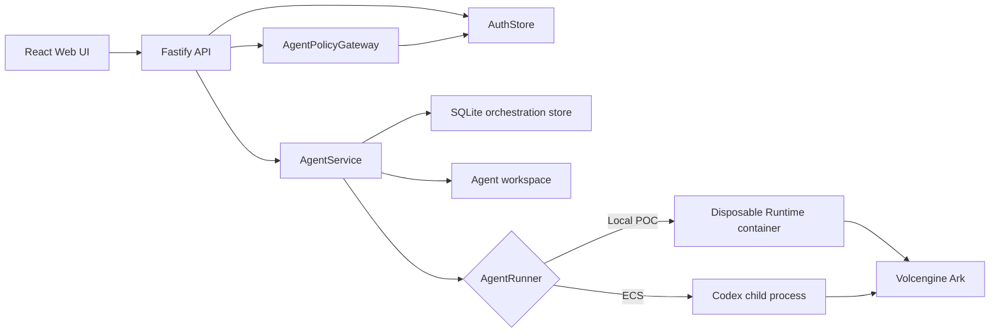

# Architecture

Volc Agent Launchpad is a single-node control plane for hackathon use.



## Components

### Web UI

Lists Agents, manages lifecycle actions, submits prompts, and polls asynchronous
Runs. It never receives the Ark API key.

### Fastify API

Authenticates database-backed users, checks role permissions before protected
Agent actions, and routes Agent tool calls through the delegated policy
gateway. It optionally protects remote demos with the shared
`APP_AUTH_TOKEN` deployment gate, and serves the compiled Web UI. The shared
token is not user identity or authorization.

Human management requests use `Authorization: Bearer <session>`. Runtime tool
requests use `X-Agent-Principal-Token: <credential>`. The two identities are
validated separately.

### AgentService

Coordinates lifecycle state, persistence, workspaces, and Runs. One Agent can
have only one active Run.

```text
ready -> busy -> ready
  |       |
  v       v
stopped  error
   \       /
    `-> archived
```

Interrupted Runs become `cancelled` after a restart. Archived Agents retain
their runs and messages for history inspection.

Delegated runs can pause without releasing their Agent:

```text
queued -> running -> waiting -> running -> completed
                         \-> failed/cancelled
```

### Storage

```text
data/auth.db              Users, roles, sessions, permissions, Agent principals,
                          credentials, capabilities, mock resources, audits,
                          orchestration jobs/runs/messages, and audit links
data/launchpad.json       Legacy import source used only when the SQLite database is empty
workspaces/AgentID/       Agent-created files
workspaces/.deleted/      Archived deleted workspaces
codex-home/               Codex configuration and sessions
```

`SqliteAgentStore` is the active runtime persistence adapter. It applies the
auth prerequisite followed by orchestration migrations and keeps the existing
AgentService response models stable during the cutover. A legacy
`launchpad.json` file is imported once on first start when no SQLite Agents
exist; SQLite is then the source of truth.

`AuthStore` uses Node's built-in SQLite support for the authentication
migration. It stores only password hashes and session-token hashes. In
development it applies the deterministic Alice/Bob seed and the mock policy
records; production does not auto-seed demo users. `AgentPolicyGateway` keeps
capability and action-log rules out of the HTTP handlers.

### Runtime providers

- `CodexRunner` runs Codex inside the application container for ECS.
- `ContainerCodexRunner` starts one disposable Docker, Colima, or Podman
  container for every local turn.

Both providers use argv-only process execution, bound output and time, resume
the stored Codex thread, and escalate termination after a grace period.

## Deployment profiles

| Profile | Control plane | Agent execution |
| --- | --- | --- |
| Local POC | Host Node.js | Disposable local container |
| ECS | Application container | Codex process in the same container |
| Local development | Host Node.js | Host Codex process |

## Extension seams

| Track | Primary seam | Expected change |
| --- | --- | --- |
| Glass Box | `AgentRunner`, `AgentRun` | Emit and display correlated execution events. |
| Bouncer | `AuthStore`, `AgentPolicyGateway`, API routes | Human identity, object-level ownership, independent per-Agent principals, scoped capabilities, and revocation. |
| Kill Switch | `AgentRunner` | Add threat-specific policy or a stronger sandbox. |

The current container or ECS instance is the POC trust boundary. Ordinary
containers are not hardened multi-tenant isolation.
