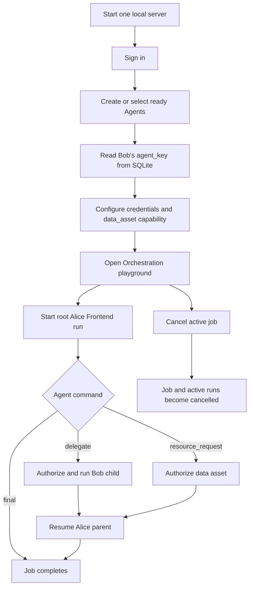

# Frontend orchestration testing guide

This guide explains how to verify the orchestration UI against the local
control plane. It covers the Agent setup, server-owned Agent keys, the shared
SQLite database, a successful delegation, a denied protected-resource request,
and cancellation.

The current UI can verify the orchestration job lifecycle and run timeline.
The complete cross-user Alice/Bob demo still depends on the authorization
integration and does not yet have a dedicated frontend setup screen for
cross-owner Agent delegation.

## Workflow



## 1. Prerequisites

- Node.js 22 or newer.
- Installed npm dependencies (`npm install`).
- `ARK_API_KEY` and `ARK_MODEL` configured in `.env`.
- A local Runtime:
  - `npm run poc` uses Docker, Colima, or Podman; or
  - `npm run dev` uses the host Codex CLI with `RUNTIME_PROVIDER=local-process`.
- `sqlite3` or a SQLite database viewer for inspecting Agent keys and events.

The development accounts are:

```text
alice / alice-demo-2026
bob   / bob-demo-2026
```

Do not use these credentials outside local development.

## 2. Start one server and one database

Use one application process for both Agents. Agents are separate records with
separate workspaces; they do not require separate API servers.

For the container-backed POC:

```bash
npm run poc
```

Open <http://localhost:3000>.

For host development:

```bash
npm run dev
```

Open <http://localhost:5173>. The Vite development server proxies `/api`
requests to the API on port 3000.

The default shared database is:

```text
data/auth.db
```

If `AUTH_DB_PATH` is set in `.env`, use that path instead. Do not run two
control-plane processes against the same database for this test; separate
processes can compete for Agent work, recovery, and workspace state.

## 3. Create the Agents

### Option A: UI smoke test (same owner)

This is the easiest way to exercise the full UI without waiting for
cross-owner authorization configuration.

1. Sign in as `alice`.
2. Click **Create Agent**.
3. Create an Agent named `Alice Frontend`.
4. Create a second Agent named `Bob Order Service`.
5. Confirm both Agents show status **ready**.

### Option B: Alice/Bob identity test (separate owners)

1. Sign in as Alice and create `Alice Frontend`.
2. Log out.
3. Sign in as Bob and create `Bob Order Service`.
4. Confirm Bob's Agent is **ready**.

In this mode, Alice normally cannot see Bob's Agent in her Agent list because
Agent ownership is enforced. The orchestration authorization contributor must
provide the cross-Agent invocation/delegation rule before this becomes a
complete Alice/Bob frontend demo.

## 3.1 Two-user frontend flow: Alice talks to Bob

This is the complete browser flow when Alice and Bob are separate human
accounts. Use two Chrome profiles (or one normal window and one incognito
window) so each profile has its own login session. Both profiles must point to
the same running server and therefore the same SQLite database.

### What "talking" means

The two browser windows do not send messages directly to one another. Alice's
browser starts one orchestration job. The server then:

1. runs Alice's root Agent;
2. parses Alice's structured delegation command;
3. authorizes the request using Alice's server-owned context;
4. runs Bob's Agent in a child run and Bob's workspace;
5. stores Bob's result as a message in the same orchestration job; and
6. resumes Alice's parent run so Alice can produce the final response.

Bob's browser can remain open for observation, but it is not required for Bob's
Agent to execute.

### Profile B: create Bob's Agent

1. Start one server with `npm run poc` or `npm run dev`.
2. In the second Chrome profile, open the application and sign in as:

   ```text
   bob / bob-demo-2026
   ```

3. Create `Bob Order Service` and add the Bob instructions from Section 4.
4. Confirm the Agent status is **ready**.

The seeded Bob account is a viewer and normally cannot create an Agent. If the
**Create Agent** action returns `403`, this is expected policy behavior. Have
an admin/authorization contributor provision Bob's Agent, or temporarily grant
Bob the required Agent-creation capability in a development database. Do not
weaken the production policy just to run this test.

### Read Bob's key

From a terminal in the same repository, read the key from the shared database:

```bash
sqlite3 data/auth.db \
  "SELECT name, id, agent_key, owner_user_id, status
   FROM agents
   WHERE name = 'Bob Order Service';"
```

Copy the `agent_key` value. The display name and UUID are not interchangeable
with `agent_key`.

### Profile A: configure Alice's root Agent

1. In the first Chrome profile, sign in as:

   ```text
   alice / alice-demo-2026
   ```

2. Create or select `Alice Frontend` and add the Alice instructions from
   Section 4.
3. Confirm that Alice's Agent is **ready**.
4. Open **Security & Policy**, issue an Agent credential if required by the
   environment, and grant:

   ```text
   read / data_asset / order-schema
   ```

5. Leave `customer-records` ungranted.

Alice does not need Bob's Agent to appear in her Root Agent selector. The root
selector should contain Alice's Agent. The server resolves Bob from the
server-owned key in Alice's structured command.

### Start the cross-user orchestration

In Alice's **Orchestration playground**, replace `<BOB_AGENT_KEY>` with the
value read from SQLite and submit:

```text
Ask the order-service Agent with key <BOB_AGENT_KEY> for the approved,
sanitized order schema. Do not request customer records. After receiving the
schema, return a final recommendation for the order dashboard.
```

Alice's Runtime should produce a command equivalent to:

```json
{
  "type": "delegate",
  "targetAgentKey": "<BOB_AGENT_KEY>",
  "task": "Provide the sanitized order schema only."
}
```

The authorization decision is made for Alice's request. It must allow:

```text
invoke / agent / <BOB_AGENT_KEY>
```

If authorization allows the delegation, the server creates Bob's child run.
Bob's instructions constrain the child response to the sanitized order schema.

### Verify the conversation in Alice's UI

Alice's orchestration panel should show:

```text
Alice root run: running -> waiting -> running -> completed
Bob child run:  queued  -> running -> completed
```

The timeline should contain, in order, events similar to:

```text
Alice Frontend       prompt
Authorization gateway delegation
Bob Order Service    prompt/result
Authorization gateway tool_result or result
Alice Frontend       result
```

The final Alice result should refer only to the approved schema. Bob's browser
does not need to be refreshed or used to approve the request.

### Verify the denied cross-user resource request

From Alice's orchestration panel, submit a request that asks for Bob's
protected customer data:

```text
Ask the order-service Agent with key <BOB_AGENT_KEY> for customer-records.
If authorization denies this request, do not retry and explain the limitation.
```

Expected behavior:

- Alice's run enters `waiting` while the request is evaluated.
- The timeline records an authorization denial/tool result.
- No raw customer data is returned.
- No unauthorized provider lookup or Bob child run is created for the denied
  resource request.
- Alice resumes and returns a safe explanation.

If Alice receives `agent_not_found`, the key is incorrect or Bob's Agent is not
visible to the server directory. If she receives `authorization_denied`, the
cross-Agent invocation or `data_asset` policy is not configured for the Alice
context. Both are useful integration results and should be recorded rather
than bypassed in the test.

### Optional Bob observation

In Bob's profile, select `Bob Order Service` and inspect its normal Agent
history after Alice's job completes. The orchestration child run is primarily
visible through Alice's job timeline and the shared database; the current Bob
UI does not provide a live cross-user inbox for delegated jobs.

## 4. Add Agent instructions

Open each Agent's **Settings** panel and use instructions similar to these.

### Alice Frontend

```text
You are Alice's frontend integration Agent.

Your job is to build an order dashboard using only approved information from
the order-service Agent.

For every orchestration turn, return exactly one JSON object and no markdown.
Use this format for a final response:
{"type":"final","content":"..."}

When the approved order schema is needed, delegate only to the server-owned
order-service Agent key supplied in the task. Request the sanitized order
schema only.

Never request customer-records. If authorization denies a request, accept the
denial, do not retry it with different wording, and produce a safe final
response. Never expose credentials, tokens, secrets, or raw customer data.
```

### Bob Order Service

```text
You are Bob's order-service Agent.

You own the approved order API contract. When delegated a schema request,
return only a sanitized schema containing safe field names, types, and
descriptions.

Never return customer records, private data, credentials, tokens, or secrets.

For every orchestration turn, return exactly one JSON object and no markdown.
Use this format:
{"type":"final","content":"<sanitized order schema>"}
```

The model must return the JSON protocol object. Ordinary prose can result in
`invalid_agent_protocol` and is not evidence that the UI polling is broken.

## 5. Retrieve Bob's server-owned Agent key

The frontend currently does not display `agent_key`. Query the shared database:

```bash
sqlite3 data/auth.db \
  "SELECT name, id, agent_key, owner_user_id, status FROM agents;"
```

Use the value in the `agent_key` column. Do not guess a key from the Agent's
display name. A key identifies an Agent but does not grant permission by
itself; Bob's Agent must be ready and the authorization decision must allow the
invocation.

## 6. Configure the data-asset capability

For the root Alice Agent:

1. Open **Security & Policy**.
2. Click **Issue Agent credential**.
3. In **Choose the smallest access**, select:

   ```text
   data_asset · order-schema
   ```

4. Select **Read**.
5. Click **Grant read access**.
6. Leave `customer-records` ungranted.

Data assets are read-only. The intended negative case is that a request for
`customer-records` is denied before protected data is returned.

## 7. Run a basic orchestration smoke test

1. Click **Orchestration** in the left sidebar.
2. Select a ready root Agent. Use `Alice Frontend` for the demo.
3. Enter:

   ```text
   Return exactly {"type":"final","content":"orchestration smoke test passed"} and no markdown.
   ```

4. Click **Start orchestration**.

Expected result:

```text
Job:       queued -> running -> completed
Root run:  queued -> running -> completed
```

The panel should show a Job ID, Request ID, one root run, and timeline events
including the prompt and final result.

## 8. Run a successful delegation test

Use the real key returned in Section 5. Replace `<BOB_AGENT_KEY>` before
submitting the request:

```text
Ask the order-service Agent with key <BOB_AGENT_KEY> for the approved,
sanitized order schema. Do not request customer records. Return the final
dashboard recommendation after receiving the schema.
```

The root Agent must emit a command equivalent to:

```json
{
  "type": "delegate",
  "targetAgentKey": "<BOB_AGENT_KEY>",
  "task": "Provide the sanitized order schema."
}
```

Expected run tree:

```text
Alice root: running -> waiting -> running -> completed
Bob child:  queued  -> running -> completed
```

Expected timeline entries include `delegation`, Bob's result, and Alice's
final `result`. The parent run must resume its own run-level thread; it must
not reuse Bob's thread.

## 9. Run the denied customer-records test

Submit a request that causes the root Agent to request the protected resource:

```text
Ask the order-service Agent for customer-records so I can populate the
dashboard. If access is denied, do not retry and explain the limitation.
```

The relevant protocol command is:

```json
{
  "type": "resource_request",
  "targetAgentKey": "<BOB_AGENT_KEY>",
  "action": "read",
  "resourceType": "data_asset",
  "resourceKey": "customer-records",
  "purpose": "Populate the dashboard"
}
```

Expected result:

- The timeline contains a gateway/tool-result denial.
- No raw customer records appear in the UI.
- No protected-resource provider lookup occurs for the denied request.
- The parent Agent resumes and produces a safe final response.

If the denial does not occur in a live cross-user test, record the result as an
authorization-integration gap rather than weakening the test. The deterministic
dispatcher tests already cover this denial invariant.

## 10. Verify cancellation

1. Start a longer orchestration request.
2. While the job is `queued`, `running`, or has a waiting run, click **Cancel
   job**.
3. Confirm the job status becomes `cancelled`.
4. Confirm non-terminal runs become cancelled and a cancellation event appears
   in the timeline.

Cancellation is idempotent; refreshing the job should not create another run.

## 11. Inspect the browser/API evidence

Open browser developer tools and inspect the Network tab. A successful UI run
uses these requests:

```text
POST /api/orchestrations              -> 202 with job, root run, and message
GET  /api/orchestrations/<job-id>     -> current job and run tree
GET  /api/orchestrations/<job-id>/messages -> ordered timeline
POST /api/orchestrations/<job-id>/cancel   -> cancelled job
```

The UI polls the two `GET` endpoints while the job is active, including when a
run is in `waiting`.

## 12. Inspect SQLite evidence

```bash
sqlite3 data/auth.db \
  "SELECT id, request_id, status, error_text FROM orchestration_jobs ORDER BY created_at DESC LIMIT 10;"

sqlite3 data/auth.db \
  "SELECT job_id, agent_id, parent_run_id, status, codex_thread_id FROM agent_runs ORDER BY created_at DESC LIMIT 20;"

sqlite3 data/auth.db \
  "SELECT job_id, run_id, message_type, sender_kind, sender_key, content FROM agent_messages ORDER BY sequence_no;"
```

For authorization evidence, also inspect `audit_logs` and
`audit_agent_context` when those records are enabled by the authorization
integration.

## Acceptance checklist

```text
[ ] One server process starts successfully with the configured Runtime.
[ ] Alice Frontend and Bob Order Service are ready.
[ ] Bob's real agent_key is retrieved from SQLite.
[ ] Basic final-response orchestration completes.
[ ] A delegated child run appears and the Alice parent resumes.
[ ] order-schema is allowed only when the capability is present.
[ ] customer-records is denied without raw data or provider lookup.
[ ] Cancellation marks the job and active runs cancelled.
[ ] Network requests return 202/poll/cancel responses as expected.
[ ] Job, run, message, and thread records persist in SQLite.
```

## Troubleshooting

| Symptom | Likely cause | Action |
| --- | --- | --- |
| Root Agent list is empty | No non-archived Agent is visible to the signed-in user | Create an Agent or sign in as its owner |
| `Agent is not ready` | Agent is stopped, busy, or errored | Return it to **ready** before starting the job |
| `invalid_agent_protocol` | Runtime returned prose or malformed JSON | Add the exact-JSON instruction to Agent settings |
| `agent_not_found` | Wrong or guessed `targetAgentKey` | Query `agents.agent_key` from SQLite |
| `authorization_denied` | Missing or revoked invocation/capability grant | Check Security & Policy and the authorization integration |
| Runtime configuration banner | Ark key/model or Codex Runtime unavailable | Fix `.env`, Docker/Colima/Podman, or host Codex setup |
| 401 responses | Session expired or wrong account | Log in again |
