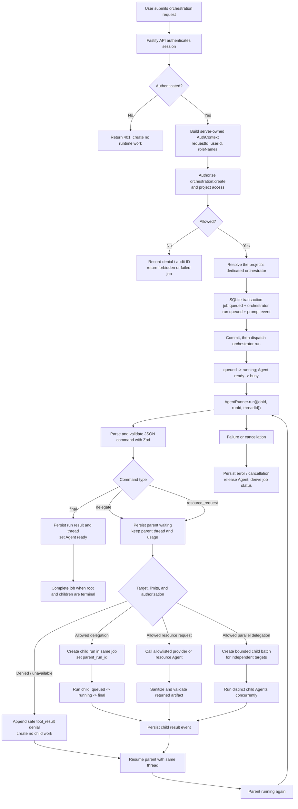
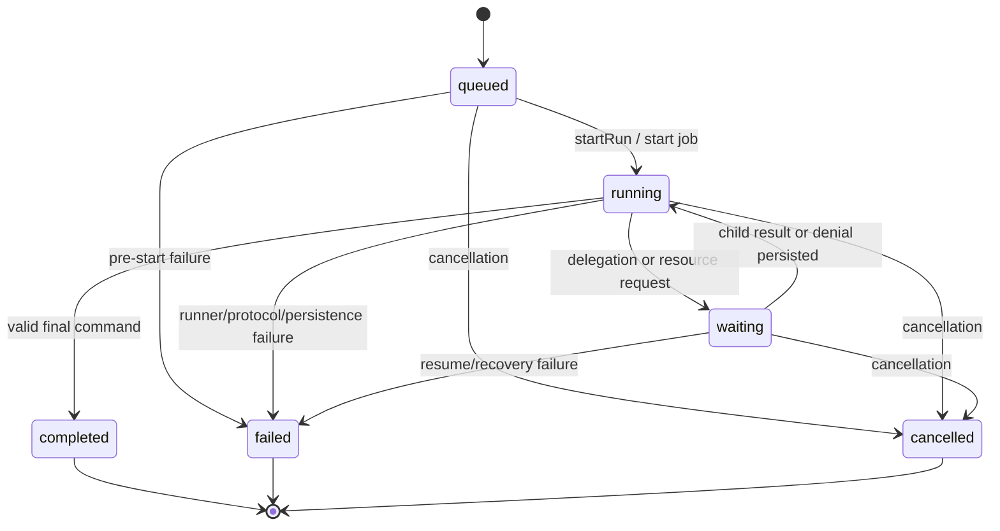

# Multi-Agent Orchestration Workflow

This document describes how one authenticated request becomes an auditable
orchestration job, how Agents delegate work, how authorization gates each
execution, and how the parent Agent resumes after child work completes.

The workflow is sequential by default. Project orchestrators can explicitly
issue a bounded parallel delegation for independent tasks; the dispatcher
still keeps authorization, run limits, and Agent ownership checks in place.
It uses SQLite as the runtime source of truth and keeps the authorization
implementation behind the shared `Authorizer` interface.

Related documents:

- [Orchestration middleware implementation tracker](ORCHESTRATION_MIDDLEWARE_IMPLEMENTATION.md)
- [Multi-agent authorization integration](MULTI_AGENT_AUTH_INTEGRATION.md)
- [Database schema reference](../MIDDLEWARE_DATABASE_SCHEMA.md)
- [Local proof-of-concept guide](LOCAL_POC.md)

## 1. Participants

| Participant | Responsibility |
| --- | --- |
| Browser / frontend | Sends an authenticated request and polls job state; it never decides authorization. |
| Fastify API | Validates the request, creates `AuthContext`, checks object ownership, and invokes the orchestration service. |
| `AuthStore` / real `Authorizer` | Resolves the caller's permissions and writes the authorization decision to `audit_logs`. |
| `AgentService` / `SqliteAgentStore` | Registers Agents, tracks Agent status, and provides the server-owned Agent directory. |
| `OrchestrationDispatcher` | Runs the state machine, validates Agent commands, authorizes child/resource work, and resumes parents. |
| `OrchestrationRepository` | Atomically persists jobs, runs, messages, threads, usage, and terminal state. |
| `AgentRunner` | Executes one Agent turn in its workspace and returns output, usage, and a Codex thread ID. |
| Protected resource provider | Allowlisted adapter for sanitized assets such as `order-schema` and the read-only `database` query surface; it never accepts raw SQL or filesystem access. |

The current dispatcher is wired to fake authorization, Agent directory, and
runner implementations in tests. Real API dispatch, provider adapters, and
the concrete authorization seam are integration work described at the end of
this document.

## 2. End-to-end workflow

The following diagram shows the complete happy path and the two guarded
branches: delegation and protected-resource access.



The parent must enter `waiting` before the dispatcher checks or creates child
work. This makes the hand-off durable and prevents a second job from racing
the same Agent context.

## 3. Request and authorization phase

1. For a project job, the client sends the user prompt and project ID. The
   server resolves that project's dedicated orchestrator; the client cannot
   select or replace it. Non-project orchestration may still send an Agent ID.
2. Authentication middleware validates the bearer session and creates an
   `AuthContext` containing `requestId`, `userId`, and `roleNames`. The caller
   identity is not accepted from the JSON body.
3. The API authorizes orchestration creation and project edit access, then
   resolves the hidden project orchestrator from SQLite. Participating Agent
   delegation and protected-resource access remain independently authorized.
4. The server verifies that the orchestrator exists and is ready. Display names
   are not permission keys; routing uses stable server-owned `agent_key` values.
5. A denied request stops before `AgentRunner.run()` and returns a stable
   reason code. The returned `auditLogId` and `requestId` are retained for
   later correlation when the audit-context repository is integrated.

The shared authorization boundary is:

```ts
authorize(
  context: AuthContext,
  action: string,
  resourceType: string,
  resourceKey: string,
): Promise<AuthorizationDecision>
```

Typical decisions are `orchestration:create`, `invoke` on an `agent`, and
`read` on a protected `data_asset`. The merged contract recognizes the resource
families `agent`, `run`, `orchestration`, `system`, and `data_asset`; the
authorization contributor still owns the production policy decisions.

## 4. Atomic job creation

After authorization succeeds, the repository creates the initial records in a
single SQLite write transaction:

| Record | Important values |
| --- | --- |
| `orchestration_jobs` | `status = queued`, caller `user_id`, `request_id`, and original input |
| Orchestrator `agent_runs` row | `status = queued`, `parent_run_id = NULL`, project orchestrator `agent_id`, prompt, and a null/new run thread |
| `agent_messages` row | `sequence_no = 0`, `message_type = prompt`, caller prompt, and root `run_id` |

The transaction is committed before runtime work begins. If any insert fails,
no partial job, run, or prompt is visible.

## 5. Starting and executing a run

1. The dispatcher loads the job and run and verifies that the run belongs to
   the job.
2. `startRun` changes `queued -> running`, records `started_at`, marks the
   Agent busy, and enforces the one-active-run-per-Agent invariant.
3. The runner receives an execution context containing:

   ```ts
   {
     agentId,
     workspacePath,
     prompt,
     threadId: run.codexThreadId,
     jobId: run.jobId,
     runId: run.id,
   }
   ```

4. The runner returns output, optional usage, and an optional Codex thread ID.
5. The dispatcher parses the output as a strict JSON command. Plain prose,
   unknown fields, missing fields, and invalid values are rejected as a safe
   run failure; they never create child work.

### Run-level thread ownership

`agent_runs.codex_thread_id` is canonical for orchestration. Every run owns its
conversation context:

- A root run starts with its own null/new thread.
- The returned thread ID is persisted with the run result or before it enters
  `waiting`.
- A resumed parent is called with that same parent thread ID.
- A child run receives a different thread and can never inherit a thread from
  another Agent or job.
- The legacy Agent-level thread field may remain as a UI mirror, but it is not
  used to resume orchestration runs.

This prevents two jobs using the same Agent from sharing hidden conversation
history.

## 6. Command handling

Agent output is a discriminated union with four allowed command types:

```json
{ "type": "final", "content": "..." }
```

```json
{ "type": "delegate", "targetAgentKey": "bob-order-service", "task": "..." }
```

```json
{
  "type": "resource_request",
  "targetAgentKey": "bob-order-service",
  "action": "read",
  "resourceType": "data_asset",
  "resourceKey": "order-schema",
  "purpose": "Build the order dashboard"
}
```

```json
{
  "type": "delegate_parallel",
  "delegations": [
    { "targetAgentKey": "alice-frontend", "task": "Build the UI shell." },
    { "targetAgentKey": "bob-order-service", "task": "Define the API contract." }
  ]
}
```

### Final command

The `content` field may be plain text or a JSON object/array for structured
artifacts such as API contracts. Structured content is preserved in
`output_json` and rendered as readable text in `output_text`, so a contract
does not fail validation just because it is not a sentence.

For `final`, the dispatcher atomically:

1. updates the run to `completed`;
2. stores `output_text`, validated `output_json`, the latest thread ID, and
   accumulated usage;
3. appends a `result` event to the job stream; and
4. returns the Agent to `ready`.

The job becomes `completed` when the root run and all required child runs are
terminal. The root result becomes the job output.

### Delegation command

For `delegate`, the dispatcher:

1. changes the parent run `running -> waiting`, preserving its thread and
   accumulated usage;
2. validates target existence, active status, self-delegation, ancestry cycles,
   maximum depth, and maximum run count;
3. asks the `Authorizer` to authorize `invoke` on the target `agent_key`;
4. if allowed, atomically appends a `delegation` event and creates a child run
   with the same `job_id` and `parent_run_id` pointing to the waiting parent;
5. runs the child with its own thread; and
6. appends a child `result` (or safe failure) before resuming the parent.

If any guard or authorization check denies delegation, no child run is
created. Instead, the dispatcher appends a `tool_result` containing an
`authorization_denied` envelope and resumes the parent with its original
thread.

### Parallel delegation

`delegate_parallel` is an explicit opt-in for two to eight independent tasks.
The dispatcher validates every target before creating any child, rejects
duplicate targets, and starts the distinct child runs concurrently. Their
results are combined into one resume envelope for the project orchestrator.
The orchestrator is instructed to use this only when tasks do not edit the
same files and do not depend on each other's output. Dependent work remains a
normal sequential `delegate` so the first result can be reviewed before the
next Agent is started.

### Protected resource request

For `resource_request`, authorization is evaluated before any provider lookup
or data release:

- Denied: append a safe denial `tool_result`, perform no provider lookup, and
  create no Bob child run.
- Allowed: call only an allowlisted provider or resource Agent, validate and
  sanitize the returned artifact, persist the result, and resume the requester.

The current dispatcher models an allowed resource request as a child Agent
invocation. The local provider supports the exact `data_asset` vocabulary,
including shared `database` and `database:users` resources. Database requests
use allowlisted query DSLs (`orders.list`/`orders.summary` or
`users.list`/`users.summary`) and are sanitized before the result is returned;
raw SQL, arbitrary table names, and filesystem access must never be exposed to
an Agent. Production authorization still owns the final capability decision.

### Shared database resource

The development catalog includes two shared read-only database resources:
`data_asset:database` for order data and `data_asset:database:users` for the
sanitized users projection. Agents must include one of these exact query values
for the resource they request:

```text
orders.list?status=pending&limit=10&sort=created_at_desc
orders.summary?status=fulfilled
users.list?status=active&limit=25&sort=username_asc
users.summary?status=all
```

Only the documented `status`, `limit`, and `sort` parameters are accepted. The
provider returns sanitized order fields or the fixed users projection and
never exposes customer records, private notes, password hashes, sessions,
credentials, secrets, or arbitrary SQL results. A capability for either
`read / data_asset / database` or `read / data_asset / database:users` must be
granted to the target Agent before the provider is called. The users resource
reads the server-owned SQLite file; Agents never receive the database path or a
database connection.

## 7. Parent resumption

The child result or denial must be durable before the parent resumes:

1. Append a `tool_result` event under the parent run and job.
2. Change the parent `waiting -> running` with `resumeRun`.
3. Invoke the same parent Agent with the same `codex_thread_id` and a validated
   resume envelope.
4. The parent returns another command. It may produce a final answer, delegate
   again, or request another protected resource.
5. Repeat until the root reaches `completed`, `failed`, or `cancelled`.

Example resume envelopes:

```json
{
  "type": "child_result",
  "sourceAgentKey": "bob-order-service",
  "content": "The sanitized order schema is ..."
}
```

```json
{
  "type": "authorization_denied",
  "action": "read",
  "resourceType": "data_asset",
  "resourceKey": "customer-records",
  "reasonCode": "missing_permission"
}
```

## 8. State machines

### Job and run states



Jobs do not enter `waiting`; the job remains `running` while one of its runs
waits. The active-run index treats `queued`, `running`, and `waiting` as
occupied states, so one Agent cannot be assigned two live contexts.

| Entity | Normal lifecycle | Key invariant |
| --- | --- | --- |
| Job | `queued -> running -> completed` | Job completion is derived from root/child terminal state. |
| Run | `queued -> running -> waiting -> running -> completed` | `waiting` has no `completed_at` and keeps its thread. |
| Agent | `ready -> busy -> ready` | Failed/cancelled execution must release `busy`; waiting still counts as occupied. |

Failure and cancellation can occur from `queued`, `running`, or `waiting`.

## 9. Persistence and event timeline

All messages share one monotonically increasing `sequence_no` per job, which
makes a complete timeline reconstructable even when different Agents produce
the events.

| Step | Message / database effect | Required linkage |
| --- | --- | --- |
| 1 | `prompt` for the root request | `job_id`, root `run_id`, caller sender |
| 2 | `delegation` or `tool_call` command | parent `run_id`, target key, requested action/resource |
| 3 | Parent run enters `waiting` | parent thread and usage persisted transactionally |
| 4 | Child run created (allowed delegation/resource path) | same `job_id`, `parent_run_id`, separate thread |
| 5 | Child `result` or `error` | child `run_id`, source Agent, ordered sequence |
| 6 | `tool_result` resume envelope | parent `run_id`, orchestrator sender, denial/result payload |
| 7 | Parent final `result` or `error` | parent/root `run_id`, final output or safe error |

Authorization decisions should additionally link `requestId` and
`auditLogId` to Agent/run evidence through `audit_agent_context` once that
repository operation is implemented.

## 10. Alice/Bob example

Assume Bob's Agent has `read:order-schema` but not permission to read
`customer-records`.

```mermaid
sequenceDiagram
    participant UI as Alice's UI
    participant API as Orchestration API
    participant GW as Authorization Gateway
    participant A as Project orchestrator
    participant D as Dispatcher
    participant B as Bob's Agent
    participant DB as SQLite timeline

    UI->>API: Build order dashboard
    API->>GW: authorize(create + project edit access)
    GW-->>API: ALLOW + auditLogId
    API->>DB: Create job, orchestrator run, prompt
    API->>D: Dispatch orchestrator after commit
    D->>A: run(orchestrator thread)
    A-->>D: delegate Bob for approved order schema
    D->>DB: Orchestrator running -> waiting; append delegation
    D->>GW: authorize(invoke Bob / read order-schema)
    GW-->>D: ALLOW
    D->>DB: Create Bob child run
    D->>B: run(Bob child thread)
    B-->>D: Sanitized order schema
    D->>DB: Persist Bob result + tool_result
    D->>A: resume(orchestrator thread)
    A-->>D: resource_request customer-records
    D->>DB: Orchestrator running -> waiting; append tool_call
    D->>GW: authorize(read data_asset customer-records)
    GW-->>D: DENY + missing_permission
    D->>DB: Append denial; create no Bob run
    D->>A: resume(orchestrator thread with denial)
    A-->>D: final sanitized frontend plan
    D->>DB: Complete orchestrator run and job
    D-->>UI: Pollable completed result
```

Human-readable conversation:

1. Alice's Agent asks what fields the order API provides.
2. The dispatcher authorizes Bob's Agent and the `order-schema` request.
3. Bob's child run returns a sanitized order schema.
4. Alice asks for customer records.
5. The gateway denies the request because Alice has only
   `read:order-schema`.
6. The dispatcher records the denial, does not query customer data, and
   resumes Alice's original thread.
7. Alice builds the frontend against the approved schema.

The denial is a middleware-enforced result, not a suggestion in the prompt;
an Agent cannot override it by asking again in prose.

## 11. Failure, cancellation, and restart behavior

### Runtime or protocol failure

- Project runs pass a runtime-enforced response schema to Codex. Every
  participating Agent must return exactly one `final`, `delegate`,
  `delegate_parallel`, or `resource_request` command with the required fields;
  fields that do not apply are represented as `null`, and structured result
  data belongs under `final.content` as a JSON string. The schema is mounted
  read-only for container Runtimes, so this contract is not prompt-only.
- Invalid JSON, invalid commands, and clearly transient runner failures receive
  one bounded repair turn by default. The dispatcher keeps the same run,
  increments its attempt, records a recovery event, and asks the Agent to
  repeat the task using the required protocol. A successful repair completes
  normally; the recovery event remains visible in the timeline.
- If the repair also fails, or if the failure is a persistence error, the
  current run is marked failed with the exact safe diagnostic. The UI explains
  what happened, what was retried, and what the user should fix next.
- The Agent is released from `busy` so it cannot remain permanently locked.
- The job is marked failed when the root cannot reach a terminal success state.
- Error messages and audit metadata must not contain bearer tokens, API keys,
  passwords, or protected record contents.

Authorization denials, missing Agents, delegation cycles, timeouts, and user
cancellations are not automatically retried. They require a policy, project,
assignment, or task change; retrying them would repeat the same unsafe or
unproductive request.

### Timeouts and diagnostics

The dispatcher applies a wall-clock timeout to each Agent turn and to the
whole job. Defaults are 10 minutes per turn and 30 minutes per job; they can be
changed with `ORCHESTRATION_RUN_TIMEOUT_MS` and
`ORCHESTRATION_JOB_TIMEOUT_MS`. A timeout asks the runner to cancel the active
Agent, records `run_timeout` or `job_timeout`, and fails the affected run/job
safely. Set a timeout option to `null` only for controlled tests.

Structured lifecycle logs carry `requestId`, `userId`, `jobId`, `runId`, and
`agentId`. Active runs also persist safe runtime diagnostics: runtime startup,
Codex event names, and a 15-second heartbeat. The live activity card shows the
latest event and warns when a running Agent has not reported for 45 seconds.
Diagnostic messages are bounded and redact common credential patterns before
being stored or logged; raw model output and stderr are never used as progress
messages.

When a run appears stuck, first confirm that only one control plane is using
the database and that the browser is connected to its matching Web server:

```bash
lsof -nP -iTCP:3000 -sTCP:LISTEN
lsof -nP -iTCP:5173 -sTCP:LISTEN
```

Stop stale API/Web processes before restarting the POC. For the container
runtime, inspect the Agent container named in the server log or list the
runtime containers with:

```bash
docker ps --all --filter label=io.codejam.launchpad=agent-runtime
docker logs <container-name>
```

The request/job/run identifiers in the server log and the UI run tree should
match. If the container is absent, the stall is before runtime startup; if it
is present with no Codex events, the stall is inside the runtime or model call;
if the UI stops receiving heartbeats while the container is gone, the control
plane needs to be restarted and the job reconciled.

### Cancellation

The dispatcher and repository mark the job and all non-terminal runs as
`cancelled`, request runtime stop for active Agents, append cancellation
events, and release Agents. Cancellation is idempotent. The public cancel
endpoint and its authorization check remain part of the API integration work.

### Process restart

The current recovery policy is deliberately conservative: queued, running, and
waiting work that cannot be safely resumed is marked cancelled with a restart
error. This runs during server startup. Durable resumption of a waiting parent
requires a worker that can reconstruct authenticated context and verify a
persisted child result; that worker is not implemented yet.

## 12. Current implementation versus remaining integration

| Area | Current status |
| --- | --- |
| SQLite migrations, foreign keys, indexes, `waiting` state, and archived Agents | Implemented in migrations `001`–`005`; delegated policy and Agent credentials are `006`–`007`. |
| Jobs, runs, messages, thread persistence, usage accumulation | Implemented by `OrchestrationSqliteRepository`. |
| Agent JSON-to-SQLite cutover and one-time import | Implemented by `SqliteAgentStore`; JSON remains a legacy import source. |
| Structured command validation and sequential dispatcher | Implemented with fake dependencies and focused tests. |
| Frontend polling awareness of `waiting` | Implemented; the client treats it as an active run. |
| Real API routes and `202`/poll/cancel lifecycle | Pending Milestone 7. |
| Concrete `AuthStore` adapter for the shared async `Authorizer` seam | Pending authorization integration. |
| Agent-principal capability rules and resource vocabulary | Requires agreement with the authorization contributor. |
| `audit_agent_context` persistence and audit links | Pending repository and authorizer integration. |
| Allowlisted protected-resource provider and sanitization | Implemented for the local POC, including the shared order and SQLite-backed `database:users` read-only query DSLs; production provider/auth adapter remains partner integration work. |
| Archive/history preservation, cancellation, timeout, restart reconciliation, and lifecycle logs | Implemented in the repository/dispatcher; public API and durable waiting-run worker remain pending. |
| Full Alice/Bob demo with real auth, API, runner, and provider | Pending Milestone 9. |

## 13. Verification checklist

Use these checks after changing orchestration code:

```text
npm run typecheck
npm run build -w @launchpad/server
npm exec --workspace=@launchpad/server -- vitest run src/orchestration-protocol.test.ts src/orchestration-test-doubles.test.ts src/orchestration-sqlite-repository.test.ts src/orchestration-dispatcher.test.ts src/sqlite-agent-store.test.ts
```

The focused orchestration suite should cover:

- atomic root and child creation;
- ordered job messages;
- separate run-level threads across jobs and parent/child runs;
- waiting-before-child persistence;
- usage accumulation after a resumed parent;
- authorization denial without runner/provider execution;
- invalid output and runner failure;
- unknown, stopped, busy, self-targeted, cyclic, and over-limit delegation;
- restart durability for SQLite-backed Agent state.

See the implementation tracker for the latest known environment-specific test
limitations and milestone checkboxes.
